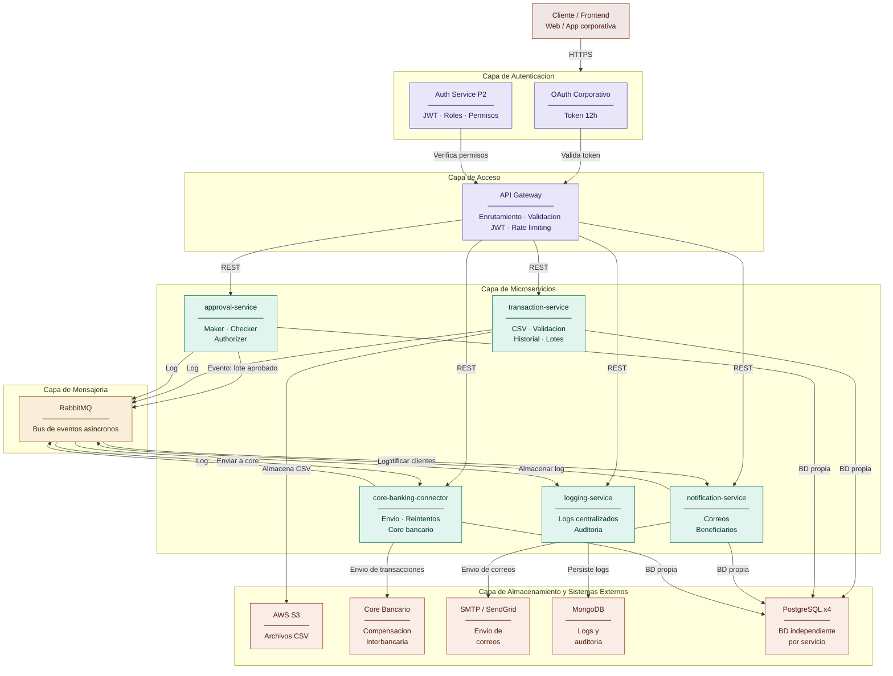

# Diagrama de Arquitectura General

```mermaid
flowchart TB
    classDef external fill:#f0e6e6,stroke:#993C1D,color:#4A1B0C
    classDef gateway fill:#e8e6f8,stroke:#534AB7,color:#26215C
    classDef micro fill:#e1f5ee,stroke:#0F6E56,color:#04342C
    classDef queue fill:#faeeda,stroke:#854F0B,color:#412402
    classDef storage fill:#faece7,stroke:#993C1D,color:#4A1B0C

    Cliente["Cliente / Frontend\nWeb / App corporativa"]

    subgraph CAPA1["Capa de Autenticacion"]
        direction LR
        OAuth["OAuth Corporativo\n─────────────\nToken 12h"]
        P2["Auth Service P2\n─────────────\nJWT · Roles · Permisos"]
    end

    subgraph CAPA2["Capa de Acceso"]
        GW["API Gateway\n─────────────\nEnrutamiento · Validacion JWT · Rate limiting"]
    end

    subgraph CAPA3["Capa de Microservicios"]
        direction LR
        TS["transaction-service\n─────────────\nCSV · Validacion\nHistorial · Lotes"]
        AS["approval-service\n─────────────\nMaker · Checker\nAuthorizer"]
        NS["notification-service\n─────────────\nCorreos\nBeneficiarios"]
        CBC["core-banking-connector\n─────────────\nEnvio · Reintentos\nCore bancario"]
        LS["logging-service\n─────────────\nLogs centralizados\nAuditoria"]
    end

    subgraph CAPA4["Capa de Mensajeria"]
        RMQ["RabbitMQ\n─────────────\nBus de eventos asincronos"]
    end

    subgraph CAPA5["Capa de Almacenamiento y Sistemas Externos"]
        direction LR
        S3["AWS S3\n─────────\nArchivos CSV"]
        CORE["Core Bancario\n─────────\nCompensacion\nInterbancaria"]
        SMTP["SMTP / SendGrid\n─────────\nEnvio de\ncorreos"]
        MONGO["MongoDB\n─────────\nLogs y\nauditoria"]
        PG["PostgreSQL x4\n─────────\nBD independiente\npor servicio"]
    end

    %% Flujo de autenticacion
    Cliente -->|"HTTPS"| CAPA1
    OAuth -->|"Valida token"| GW
    P2 -->|"Verifica permisos"| GW

    %% API Gateway a microservicios
    GW -->|"REST"| TS
    GW -->|"REST"| AS
    GW -->|"REST"| NS
    GW -->|"REST"| CBC
    GW -->|"REST"| LS

    %% Mensajeria asincrona
    AS -->|"Evento: lote aprobado"| RMQ
    RMQ -->|"Notificar clientes"| NS
    RMQ -->|"Enviar a core"| CBC
    RMQ -->|"Almacenar log"| LS

    %% Logs de cada servicio
    TS -->|"Log"| RMQ
    AS -->|"Log"| RMQ
    NS -->|"Log"| RMQ
    CBC -->|"Log"| RMQ

    %% Sistemas externos
    TS -->|"Almacena CSV"| S3
    CBC -->|"Envio de transacciones"| CORE
    NS -->|"Envio de correos"| SMTP
    LS -->|"Persiste logs"| MONGO
    TS -->|"BD propia"| PG
    AS -->|"BD propia"| PG
    NS -->|"BD propia"| PG
    CBC -->|"BD propia"| PG

    %% Estilos
    class OAuth,P2 gateway
    class GW gateway
    class TS,AS,NS,CBC,LS micro
    class RMQ queue
    class S3,CORE,SMTP,MONGO,PG storage
    class Cliente external
```