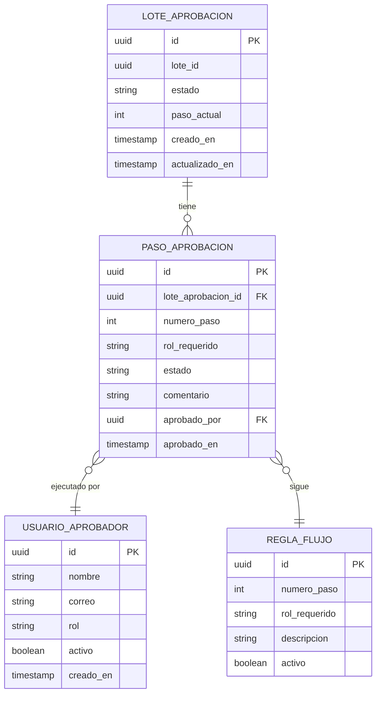

# ER - approval-service

```mermaid
erDiagram
    LOTE_APROBACION {
        uuid id PK
        uuid lote_id
        string estado
        int paso_actual
        timestamp creado_en
        timestamp actualizado_en
    }

    PASO_APROBACION {
        uuid id PK
        uuid lote_aprobacion_id FK
        int numero_paso
        string rol_requerido
        string estado
        string comentario
        uuid aprobado_por FK
        timestamp aprobado_en
    }

    USUARIO_APROBADOR {
        uuid id PK
        string nombre
        string correo
        string rol
        boolean activo
        timestamp creado_en
    }

    REGLA_FLUJO {
        uuid id PK
        int numero_paso
        string rol_requerido
        string descripcion
        boolean activo
    }

    LOTE_APROBACION ||--o{ PASO_APROBACION : "tiene"
    PASO_APROBACION }o--|| USUARIO_APROBADOR : "ejecutado por"
    PASO_APROBACION }o--|| REGLA_FLUJO : "sigue"
```