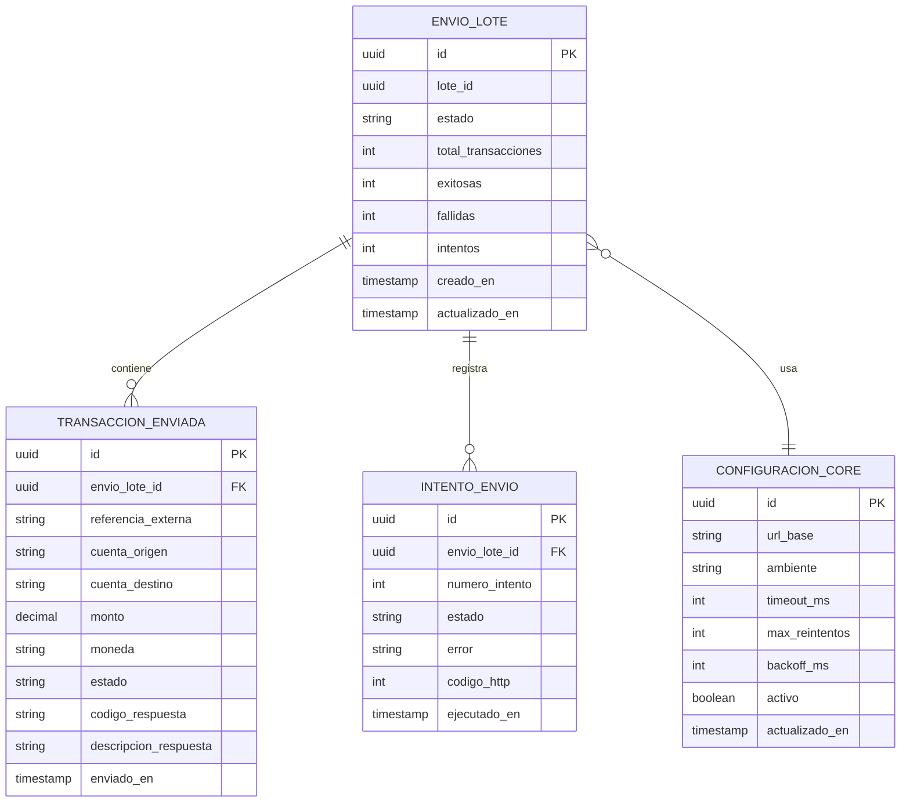

# ER - core-banking-connector

```mermaid
erDiagram
    ENVIO_LOTE {
        uuid id PK
        uuid lote_id
        string estado
        int total_transacciones
        int exitosas
        int fallidas
        int intentos
        timestamp creado_en
        timestamp actualizado_en
    }

    TRANSACCION_ENVIADA {
        uuid id PK
        uuid envio_lote_id FK
        string referencia_externa
        string cuenta_origen
        string cuenta_destino
        decimal monto
        string moneda
        string estado
        string codigo_respuesta
        string descripcion_respuesta
        timestamp enviado_en
    }

    INTENTO_ENVIO {
        uuid id PK
        uuid envio_lote_id FK
        int numero_intento
        string estado
        string error
        int codigo_http
        timestamp ejecutado_en
    }

    CONFIGURACION_CORE {
        uuid id PK
        string url_base
        string ambiente
        int timeout_ms
        int max_reintentos
        int backoff_ms
        boolean activo
        timestamp actualizado_en
    }

    ENVIO_LOTE ||--o{ TRANSACCION_ENVIADA : "contiene"
    ENVIO_LOTE ||--o{ INTENTO_ENVIO : "registra"
    ENVIO_LOTE }o--|| CONFIGURACION_CORE : "usa"
```