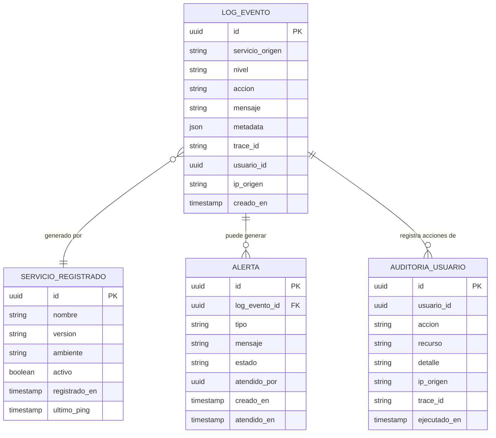

# ER - logging-service

```mermaid
erDiagram
    LOG_EVENTO {
        uuid id PK
        string servicio_origen
        string nivel
        string accion
        string mensaje
        json metadata
        string trace_id
        uuid usuario_id
        string ip_origen
        timestamp creado_en
    }

    SERVICIO_REGISTRADO {
        uuid id PK
        string nombre
        string version
        string ambiente
        boolean activo
        timestamp registrado_en
        timestamp ultimo_ping
    }

    ALERTA {
        uuid id PK
        uuid log_evento_id FK
        string tipo
        string mensaje
        string estado
        uuid atendido_por
        timestamp creado_en
        timestamp atendido_en
    }

    AUDITORIA_USUARIO {
        uuid id PK
        uuid usuario_id
        string accion
        string recurso
        string detalle
        string ip_origen
        string trace_id
        timestamp ejecutado_en
    }

    LOG_EVENTO }o--|| SERVICIO_REGISTRADO : "generado por"
    LOG_EVENTO ||--o{ ALERTA : "puede generar"
    LOG_EVENTO ||--o{ AUDITORIA_USUARIO : "registra acciones de"
```