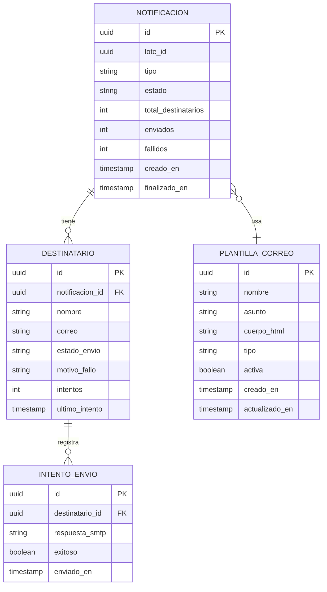

# ER - notification-service

```mermaid
erDiagram
    NOTIFICACION {
        uuid id PK
        uuid lote_id
        string tipo
        string estado
        int total_destinatarios
        int enviados
        int fallidos
        timestamp creado_en
        timestamp finalizado_en
    }

    DESTINATARIO {
        uuid id PK
        uuid notificacion_id FK
        string nombre
        string correo
        string estado_envio
        string motivo_fallo
        int intentos
        timestamp ultimo_intento
    }

    PLANTILLA_CORREO {
        uuid id PK
        string nombre
        string asunto
        string cuerpo_html
        string tipo
        boolean activa
        timestamp creado_en
        timestamp actualizado_en
    }

    INTENTO_ENVIO {
        uuid id PK
        uuid destinatario_id FK
        string respuesta_smtp
        boolean exitoso
        timestamp enviado_en
    }

    NOTIFICACION ||--o{ DESTINATARIO : "tiene"
    DESTINATARIO ||--o{ INTENTO_ENVIO : "registra"
    NOTIFICACION }o--|| PLANTILLA_CORREO : "usa"
```