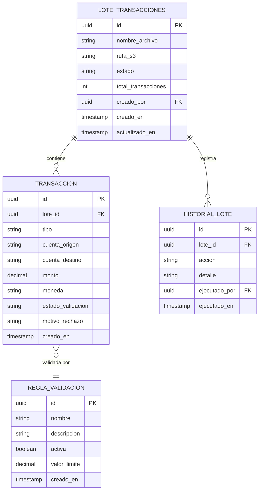

# ER - transaction-service

```mermaid
erDiagram
    LOTE_TRANSACCIONES {
        uuid id PK
        string nombre_archivo
        string ruta_s3
        string estado
        int total_transacciones
        uuid creado_por FK
        timestamp creado_en
        timestamp actualizado_en
    }

    TRANSACCION {
        uuid id PK
        uuid lote_id FK
        string tipo
        string cuenta_origen
        string cuenta_destino
        decimal monto
        string moneda
        string estado_validacion
        string motivo_rechazo
        timestamp creado_en
    }

    REGLA_VALIDACION {
        uuid id PK
        string nombre
        string descripcion
        boolean activa
        decimal valor_limite
        timestamp creado_en
    }

    HISTORIAL_LOTE {
        uuid id PK
        uuid lote_id FK
        string accion
        string detalle
        uuid ejecutado_por FK
        timestamp ejecutado_en
    }

    LOTE_TRANSACCIONES ||--o{ TRANSACCION : "contiene"
    LOTE_TRANSACCIONES ||--o{ HISTORIAL_LOTE : "registra"
    TRANSACCION }o--|| REGLA_VALIDACION : "validada por"
```