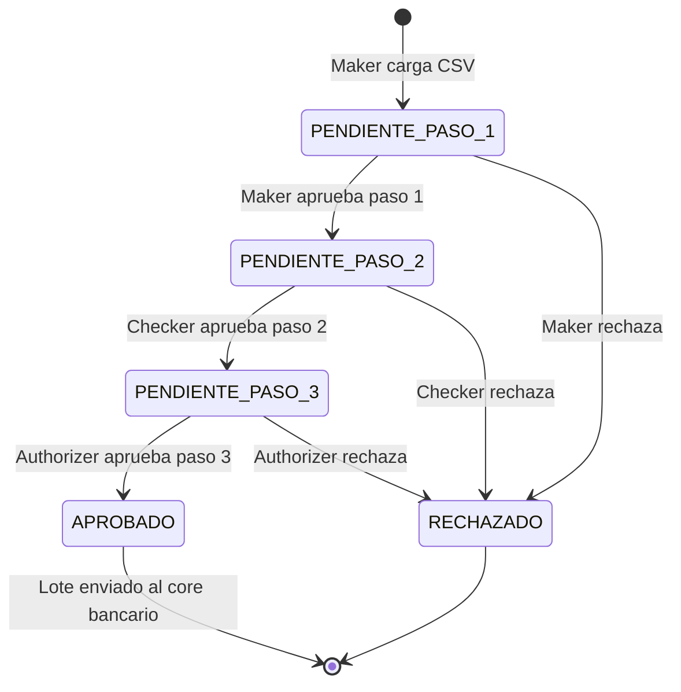

# Flujo de Aprobacion - Maker · Checker · Authorizer

## Descripcion general

El sistema implementa un flujo de aprobacion de 3 pasos obligatorios antes de enviar cualquier lote de transacciones al core bancario externo. Este esquema garantiza que ningun lote sea procesado sin la revision de al menos tres usuarios con roles distintos, reduciendo el riesgo de fraude y error humano.

## Roles involucrados

| Rol | Responsabilidad |
|-----|----------------|
| Maker | Carga el archivo CSV con las transacciones y crea el lote en el sistema |
| Checker | Revisa que el lote sea correcto y da el visto bueno en el paso 2 |
| Authorizer | Aprueba definitivamente el lote en el paso 3, habilitando su envio al core |

## Reglas del flujo

- Un mismo usuario no puede actuar en dos pasos distintos del mismo lote.
- Los pasos deben ejecutarse en orden estricto: 1 → 2 → 3.
- Si cualquier paso es rechazado, el lote queda en estado RECHAZADO y no puede continuar.
- Solo el Authorizer puede aprobar el paso 3 y disparar el evento de envio.
- Cada paso queda registrado con: usuario, rol, comentario, fecha y hora.

## Estados del lote



## Evento generado al completar el paso 3

Al aprobarse el paso 3, el approval-service publica en RabbitMQ el siguiente evento:

```json
{
  "evento": "LoteAprobado",
  "loteId": "uuid-del-lote",
  "aprobadoPor": "uuid-del-authorizer",
  "timestamp": "2026-08-13T10:00:00Z"
}
```

Este evento es consumido por:
- notification-service: envia correos a todos los clientes y beneficiarios del lote.
- core-banking-connector: envia las transacciones al sistema core bancario externo.
