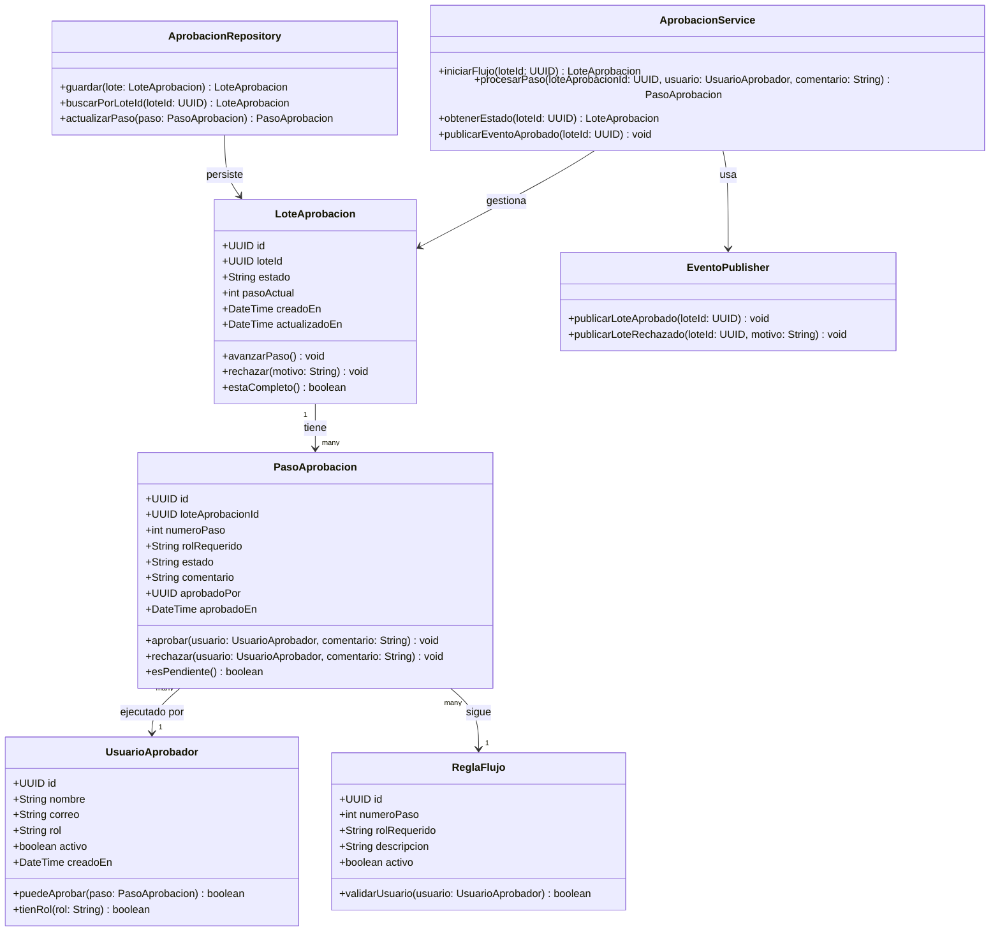

# Diagrama de Clases - approval-service

```mermaid
classDiagram
    class LoteAprobacion {
        +UUID id
        +UUID loteId
        +String estado
        +int pasoActual
        +DateTime creadoEn
        +DateTime actualizadoEn
        +avanzarPaso() void
        +rechazar(motivo: String) void
        +estaCompleto() boolean
    }

    class PasoAprobacion {
        +UUID id
        +UUID loteAprobacionId
        +int numeroPaso
        +String rolRequerido
        +String estado
        +String comentario
        +UUID aprobadoPor
        +DateTime aprobadoEn
        +aprobar(usuario: UsuarioAprobador, comentario: String) void
        +rechazar(usuario: UsuarioAprobador, comentario: String) void
        +esPendiente() boolean
    }

    class UsuarioAprobador {
        +UUID id
        +String nombre
        +String correo
        +String rol
        +boolean activo
        +DateTime creadoEn
        +puedeAprobar(paso: PasoAprobacion) boolean
        +tienRol(rol: String) boolean
    }

    class ReglaFlujo {
        +UUID id
        +int numeroPaso
        +String rolRequerido
        +String descripcion
        +boolean activo
        +validarUsuario(usuario: UsuarioAprobador) boolean
    }

    class AprobacionService {
        +iniciarFlujo(loteId: UUID) LoteAprobacion
        +procesarPaso(loteAprobacionId: UUID, usuario: UsuarioAprobador, comentario: String) PasoAprobacion
        +obtenerEstado(loteId: UUID) LoteAprobacion
        +publicarEventoAprobado(loteId: UUID) void
    }

    class EventoPublisher {
        +publicarLoteAprobado(loteId: UUID) void
        +publicarLoteRechazado(loteId: UUID, motivo: String) void
    }

    class AprobacionRepository {
        +guardar(lote: LoteAprobacion) LoteAprobacion
        +buscarPorLoteId(loteId: UUID) LoteAprobacion
        +actualizarPaso(paso: PasoAprobacion) PasoAprobacion
    }

    LoteAprobacion "1" --> "many" PasoAprobacion : tiene
    PasoAprobacion "many" --> "1" UsuarioAprobador : ejecutado por
    PasoAprobacion "many" --> "1" ReglaFlujo : sigue
    AprobacionService --> LoteAprobacion : gestiona
    AprobacionService --> EventoPublisher : usa
    AprobacionRepository --> LoteAprobacion : persiste
```
