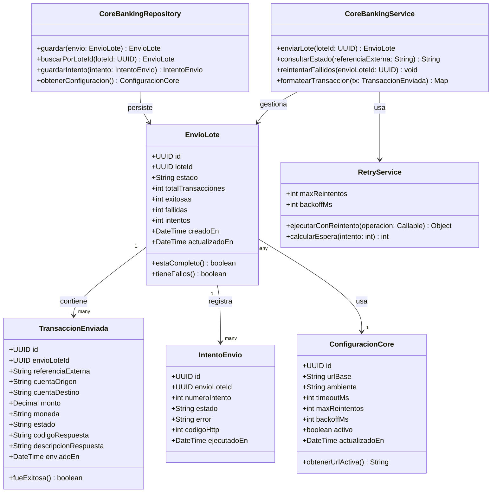

# Diagrama de Clases - core-banking-connector

```mermaid
classDiagram
    class EnvioLote {
        +UUID id
        +UUID loteId
        +String estado
        +int totalTransacciones
        +int exitosas
        +int fallidas
        +int intentos
        +DateTime creadoEn
        +DateTime actualizadoEn
        +estaCompleto() boolean
        +tieneFallos() boolean
    }

    class TransaccionEnviada {
        +UUID id
        +UUID envioLoteId
        +String referenciaExterna
        +String cuentaOrigen
        +String cuentaDestino
        +Decimal monto
        +String moneda
        +String estado
        +String codigoRespuesta
        +String descripcionRespuesta
        +DateTime enviadoEn
        +fueExitosa() boolean
    }

    class IntentoEnvio {
        +UUID id
        +UUID envioLoteId
        +int numeroIntento
        +String estado
        +String error
        +int codigoHttp
        +DateTime ejecutadoEn
    }

    class ConfiguracionCore {
        +UUID id
        +String urlBase
        +String ambiente
        +int timeoutMs
        +int maxReintentos
        +int backoffMs
        +boolean activo
        +DateTime actualizadoEn
        +obtenerUrlActiva() String
    }

    class CoreBankingService {
        +enviarLote(loteId: UUID) EnvioLote
        +consultarEstado(referenciaExterna: String) String
        +reintentarFallidos(envioLoteId: UUID) void
        +formatearTransaccion(tx: TransaccionEnviada) Map
    }

    class RetryService {
        +int maxReintentos
        +int backoffMs
        +ejecutarConReintento(operacion: Callable) Object
        +calcularEspera(intento: int) int
    }

    class CoreBankingRepository {
        +guardar(envio: EnvioLote) EnvioLote
        +buscarPorLoteId(loteId: UUID) EnvioLote
        +guardarIntento(intento: IntentoEnvio) IntentoEnvio
        +obtenerConfiguracion() ConfiguracionCore
    }

    EnvioLote "1" --> "many" TransaccionEnviada : contiene
    EnvioLote "1" --> "many" IntentoEnvio : registra
    EnvioLote "many" --> "1" ConfiguracionCore : usa
    CoreBankingService --> EnvioLote : gestiona
    CoreBankingService --> RetryService : usa
    CoreBankingRepository --> EnvioLote : persiste
```
