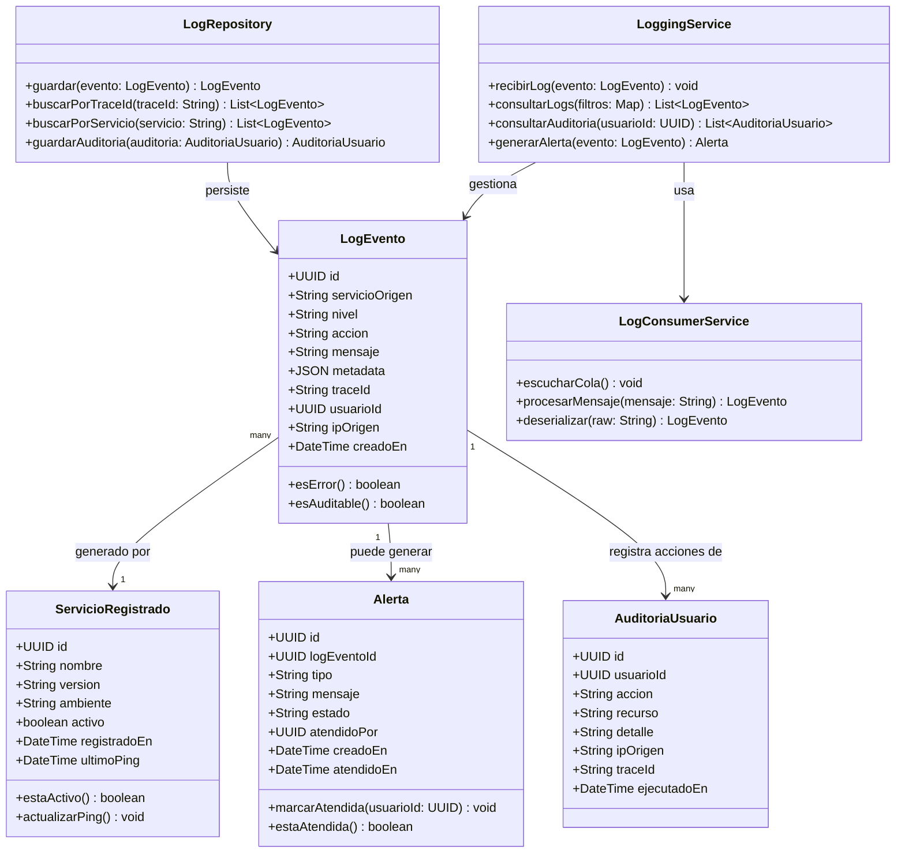

# Diagrama de Clases - logging-service

```mermaid
classDiagram
    class LogEvento {
        +UUID id
        +String servicioOrigen
        +String nivel
        +String accion
        +String mensaje
        +JSON metadata
        +String traceId
        +UUID usuarioId
        +String ipOrigen
        +DateTime creadoEn
        +esError() boolean
        +esAuditable() boolean
    }

    class ServicioRegistrado {
        +UUID id
        +String nombre
        +String version
        +String ambiente
        +boolean activo
        +DateTime registradoEn
        +DateTime ultimoPing
        +estaActivo() boolean
        +actualizarPing() void
    }

    class Alerta {
        +UUID id
        +UUID logEventoId
        +String tipo
        +String mensaje
        +String estado
        +UUID atendidoPor
        +DateTime creadoEn
        +DateTime atendidoEn
        +marcarAtendida(usuarioId: UUID) void
        +estaAtendida() boolean
    }

    class AuditoriaUsuario {
        +UUID id
        +UUID usuarioId
        +String accion
        +String recurso
        +String detalle
        +String ipOrigen
        +String traceId
        +DateTime ejecutadoEn
    }

    class LoggingService {
        +recibirLog(evento: LogEvento) void
        +consultarLogs(filtros: Map) List~LogEvento~
        +consultarAuditoria(usuarioId: UUID) List~AuditoriaUsuario~
        +generarAlerta(evento: LogEvento) Alerta
    }

    class LogConsumerService {
        +escucharCola() void
        +procesarMensaje(mensaje: String) LogEvento
        +deserializar(raw: String) LogEvento
    }

    class LogRepository {
        +guardar(evento: LogEvento) LogEvento
        +buscarPorTraceId(traceId: String) List~LogEvento~
        +buscarPorServicio(servicio: String) List~LogEvento~
        +guardarAuditoria(auditoria: AuditoriaUsuario) AuditoriaUsuario
    }

    LogEvento "many" --> "1" ServicioRegistrado : generado por
    LogEvento "1" --> "many" Alerta : puede generar
    LogEvento "1" --> "many" AuditoriaUsuario : registra acciones de
    LoggingService --> LogEvento : gestiona
    LoggingService --> LogConsumerService : usa
    LogRepository --> LogEvento : persiste
```
