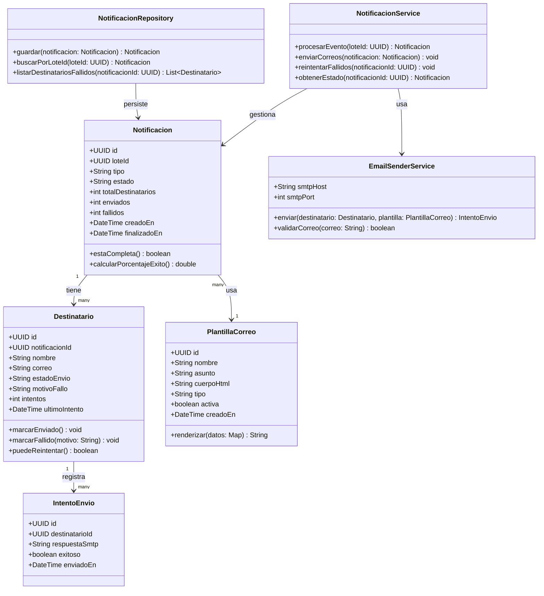

# Diagrama de Clases - notification-service

```mermaid
classDiagram
    class Notificacion {
        +UUID id
        +UUID loteId
        +String tipo
        +String estado
        +int totalDestinatarios
        +int enviados
        +int fallidos
        +DateTime creadoEn
        +DateTime finalizadoEn
        +estaCompleta() boolean
        +calcularPorcentajeExito() double
    }

    class Destinatario {
        +UUID id
        +UUID notificacionId
        +String nombre
        +String correo
        +String estadoEnvio
        +String motivoFallo
        +int intentos
        +DateTime ultimoIntento
        +marcarEnviado() void
        +marcarFallido(motivo: String) void
        +puedeReintentar() boolean
    }

    class PlantillaCorreo {
        +UUID id
        +String nombre
        +String asunto
        +String cuerpoHtml
        +String tipo
        +boolean activa
        +DateTime creadoEn
        +renderizar(datos: Map) String
    }

    class IntentoEnvio {
        +UUID id
        +UUID destinatarioId
        +String respuestaSmtp
        +boolean exitoso
        +DateTime enviadoEn
    }

    class NotificacionService {
        +procesarEvento(loteId: UUID) Notificacion
        +enviarCorreos(notificacion: Notificacion) void
        +reintentarFallidos(notificacionId: UUID) void
        +obtenerEstado(notificacionId: UUID) Notificacion
    }

    class EmailSenderService {
        +String smtpHost
        +int smtpPort
        +enviar(destinatario: Destinatario, plantilla: PlantillaCorreo) IntentoEnvio
        +validarCorreo(correo: String) boolean
    }

    class NotificacionRepository {
        +guardar(notificacion: Notificacion) Notificacion
        +buscarPorLoteId(loteId: UUID) Notificacion
        +listarDestinatariosFallidos(notificacionId: UUID) List~Destinatario~
    }

    Notificacion "1" --> "many" Destinatario : tiene
    Destinatario "1" --> "many" IntentoEnvio : registra
    Notificacion "many" --> "1" PlantillaCorreo : usa
    NotificacionService --> Notificacion : gestiona
    NotificacionService --> EmailSenderService : usa
    NotificacionRepository --> Notificacion : persiste
```
