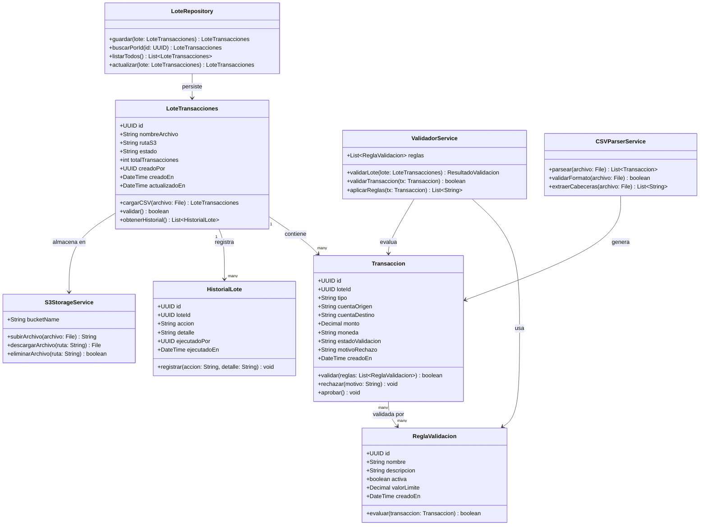

# Diagrama de Clases - transaction-service

```mermaid
classDiagram
    class LoteTransacciones {
        +UUID id
        +String nombreArchivo
        +String rutaS3
        +String estado
        +int totalTransacciones
        +UUID creadoPor
        +DateTime creadoEn
        +DateTime actualizadoEn
        +cargarCSV(archivo: File) LoteTransacciones
        +validar() boolean
        +obtenerHistorial() List~HistorialLote~
    }

    class Transaccion {
        +UUID id
        +UUID loteId
        +String tipo
        +String cuentaOrigen
        +String cuentaDestino
        +Decimal monto
        +String moneda
        +String estadoValidacion
        +String motivoRechazo
        +DateTime creadoEn
        +validar(reglas: List~ReglaValidacion~) boolean
        +rechazar(motivo: String) void
        +aprobar() void
    }

    class ReglaValidacion {
        +UUID id
        +String nombre
        +String descripcion
        +boolean activa
        +Decimal valorLimite
        +DateTime creadoEn
        +evaluar(transaccion: Transaccion) boolean
    }

    class HistorialLote {
        +UUID id
        +UUID loteId
        +String accion
        +String detalle
        +UUID ejecutadoPor
        +DateTime ejecutadoEn
        +registrar(accion: String, detalle: String) void
    }

    class ValidadorService {
        +List~ReglaValidacion~ reglas
        +validarLote(lote: LoteTransacciones) ResultadoValidacion
        +validarTransaccion(tx: Transaccion) boolean
        +aplicarReglas(tx: Transaccion) List~String~
    }

    class CSVParserService {
        +parsear(archivo: File) List~Transaccion~
        +validarFormato(archivo: File) boolean
        +extraerCabeceras(archivo: File) List~String~
    }

    class S3StorageService {
        +String bucketName
        +subirArchivo(archivo: File) String
        +descargarArchivo(ruta: String) File
        +eliminarArchivo(ruta: String) boolean
    }

    class LoteRepository {
        +guardar(lote: LoteTransacciones) LoteTransacciones
        +buscarPorId(id: UUID) LoteTransacciones
        +listarTodos() List~LoteTransacciones~
        +actualizar(lote: LoteTransacciones) LoteTransacciones
    }

    LoteTransacciones "1" --> "many" Transaccion : contiene
    LoteTransacciones "1" --> "many" HistorialLote : registra
    Transaccion "many" --> "many" ReglaValidacion : validada por
    ValidadorService --> ReglaValidacion : usa
    ValidadorService --> Transaccion : evalua
    CSVParserService --> Transaccion : genera
    LoteTransacciones --> S3StorageService : almacena en
    LoteRepository --> LoteTransacciones : persiste
```