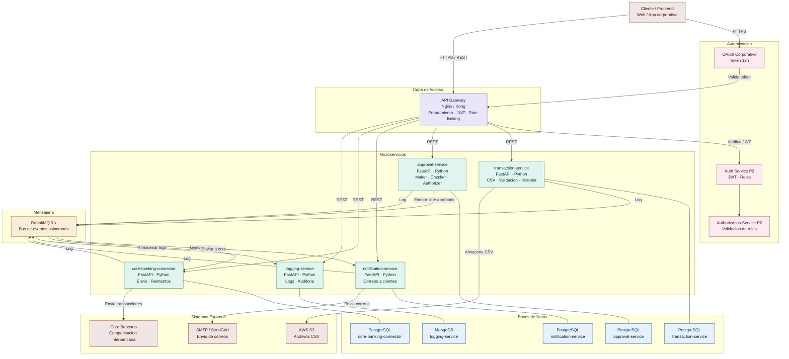

# Diagrama de Componentes - Sistema Bancario de Microservicios

```mermaid
flowchart TB
    classDef external fill:#f0e6e6,stroke:#993C1D,color:#4A1B0C
    classDef gateway fill:#e8e6f8,stroke:#534AB7,color:#26215C
    classDef micro fill:#e1f5ee,stroke:#0F6E56,color:#04342C
    classDef queue fill:#faeeda,stroke:#854F0B,color:#412402
    classDef database fill:#e6f1fb,stroke:#185FA5,color:#042C53
    classDef auth fill:#fbeaf0,stroke:#993556,color:#4B1528

    Cliente["Cliente / Frontend\nWeb / App corporativa"]

    subgraph SAUTH["Autenticacion"]
        direction LR
        OAuth["OAuth Corporativo\nToken 12h"]
        P2Auth["Auth Service P2\nJWT · Roles"]
        P2Authz["Authorization Service P2\nValidacion de roles"]
        P2Auth --> P2Authz
    end

    subgraph SGW["Capa de Acceso"]
        GW["API Gateway\nNginx / Kong\nEnrutamiento · JWT · Rate limiting"]
    end

    subgraph SMS["Microservicios"]
        direction LR
        TS["transaction-service\nFastAPI · Python\nCSV · Validacion · Historial"]
        AS["approval-service\nFastAPI · Python\nMaker · Checker · Authorizer"]
        NS["notification-service\nFastAPI · Python\nCorreos a clientes"]
        CBC["core-banking-connector\nFastAPI · Python\nEnvio · Reintentos"]
        LS["logging-service\nFastAPI · Python\nLogs · Auditoria"]
    end

    subgraph SMSG["Mensajeria"]
        RMQ["RabbitMQ 3.x\nBus de eventos asincronos"]
    end

    subgraph SDB["Bases de Datos"]
        direction LR
        DB_TS["PostgreSQL\ntransaction-service"]
        DB_AS["PostgreSQL\napproval-service"]
        DB_NS["PostgreSQL\nnotification-service"]
        DB_CBC["PostgreSQL\ncore-banking-connector"]
        DB_LS["MongoDB\nlogging-service"]
    end

    subgraph SEXT["Sistemas Externos"]
        direction LR
        S3["AWS S3\nArchivos CSV"]
        CORE["Core Bancario\nCompensacion interbancaria"]
        SMTP["SMTP / SendGrid\nEnvio de correos"]
    end

    %% Autenticacion
    Cliente -->|"HTTPS"| OAuth
    Cliente -->|"HTTPS / REST"| GW
    OAuth -->|"Valida token"| GW
    GW -->|"Verifica JWT"| P2Auth

    %% Gateway a microservicios
    GW -->|"REST"| TS
    GW -->|"REST"| AS
    GW -->|"REST"| NS
    GW -->|"REST"| CBC
    GW -->|"REST"| LS

    %% Microservicios a bases de datos
    TS --- DB_TS
    AS --- DB_AS
    NS --- DB_NS
    CBC --- DB_CBC
    LS --- DB_LS

    %% Mensajeria asincrona
    AS -->|"Evento: lote aprobado"| RMQ
    TS -->|"Log"| RMQ
    AS -->|"Log"| RMQ
    NS -->|"Log"| RMQ
    CBC -->|"Log"| RMQ
    RMQ -->|"Notificar clientes"| NS
    RMQ -->|"Enviar a core"| CBC
    RMQ -->|"Almacenar logs"| LS

    %% Sistemas externos
    TS -->|"Almacena CSV"| S3
    CBC -->|"Envia transacciones"| CORE
    NS -->|"Envia correos"| SMTP

    %% Estilos
    class Cliente external
    class OAuth,P2Auth,P2Authz auth
    class GW gateway
    class TS,AS,NS,CBC,LS micro
    class RMQ queue
    class DB_TS,DB_AS,DB_NS,DB_CBC,DB_LS database
    class S3,CORE,SMTP external
```
