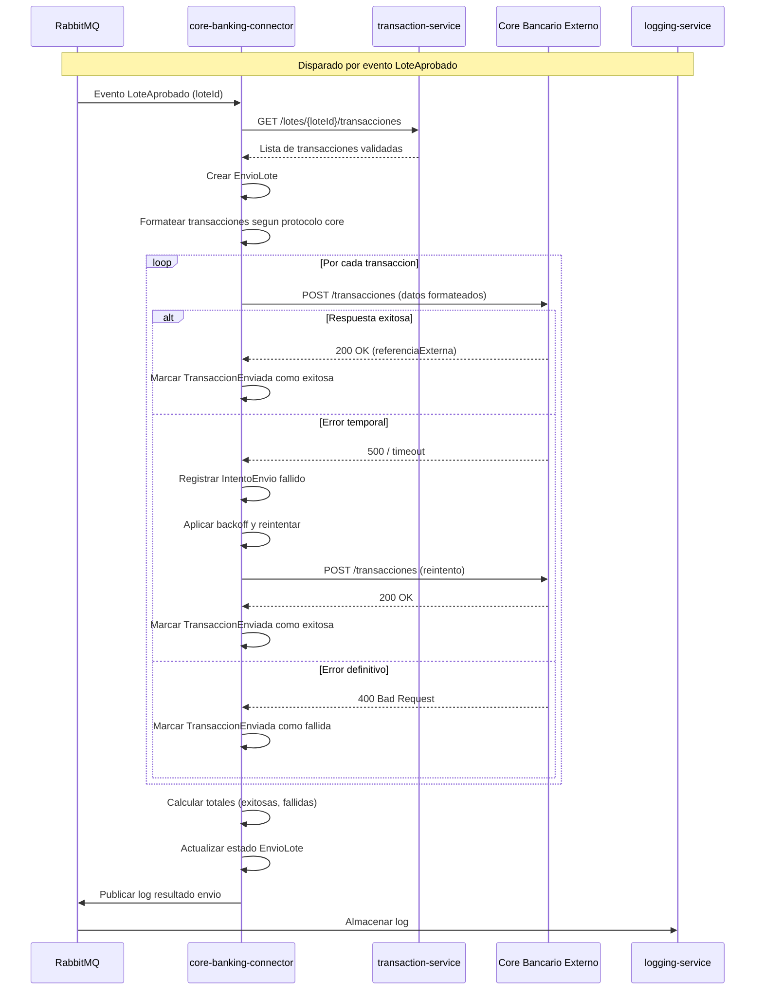

# Diagrama de Secuencia - Envio al Core Bancario

```mermaid
sequenceDiagram
    participant RMQ as RabbitMQ
    participant CBC as core-banking-connector
    participant TS as transaction-service
    participant CORE as Core Bancario Externo
    participant LS as logging-service

    Note over RMQ,LS: Disparado por evento LoteAprobado

    RMQ->>CBC: Evento LoteAprobado (loteId)
    CBC->>TS: GET /lotes/{loteId}/transacciones
    TS-->>CBC: Lista de transacciones validadas

    CBC->>CBC: Crear EnvioLote
    CBC->>CBC: Formatear transacciones segun protocolo core

    loop Por cada transaccion
        CBC->>CORE: POST /transacciones (datos formateados)
        alt Respuesta exitosa
            CORE-->>CBC: 200 OK (referenciaExterna)
            CBC->>CBC: Marcar TransaccionEnviada como exitosa
        else Error temporal
            CORE-->>CBC: 500 / timeout
            CBC->>CBC: Registrar IntentoEnvio fallido
            CBC->>CBC: Aplicar backoff y reintentar
            CBC->>CORE: POST /transacciones (reintento)
            CORE-->>CBC: 200 OK
            CBC->>CBC: Marcar TransaccionEnviada como exitosa
        else Error definitivo
            CORE-->>CBC: 400 Bad Request
            CBC->>CBC: Marcar TransaccionEnviada como fallida
        end
    end

    CBC->>CBC: Calcular totales (exitosas, fallidas)
    CBC->>CBC: Actualizar estado EnvioLote

    CBC->>RMQ: Publicar log resultado envio
    RMQ->>LS: Almacenar log
```
