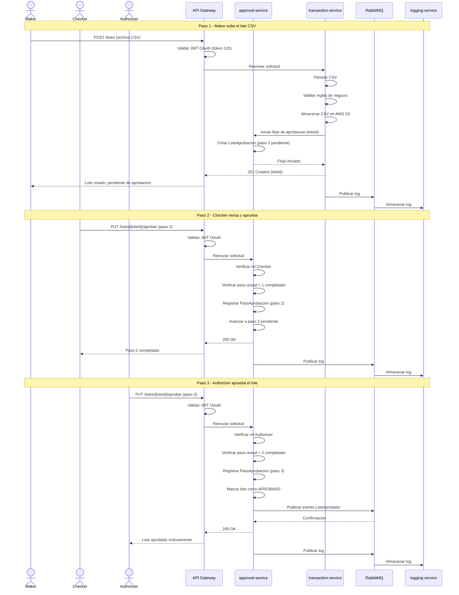

# Diagrama de Secuencia - Flujo de Aprobacion (Maker-Checker-Authorizer)

```mermaid
sequenceDiagram
    actor Maker
    actor Checker
    actor Authorizer
    participant GW as API Gateway
    participant AS as approval-service
    participant TS as transaction-service
    participant RMQ as RabbitMQ
    participant LS as logging-service

    Note over Maker,LS: Paso 1 - Maker sube el lote CSV

    Maker->>GW: POST /lotes (archivo CSV)
    GW->>GW: Validar JWT OAuth (token 12h)
    GW->>TS: Reenviar solicitud
    TS->>TS: Parsear CSV
    TS->>TS: Validar reglas de negocio
    TS->>TS: Almacenar CSV en AWS S3
    TS->>AS: Iniciar flujo de aprobacion (loteId)
    AS->>AS: Crear LoteAprobacion (paso 1 pendiente)
    AS-->>TS: Flujo iniciado
    TS-->>GW: 201 Created (loteId)
    GW-->>Maker: Lote creado, pendiente de aprobacion
    TS->>RMQ: Publicar log
    RMQ->>LS: Almacenar log

    Note over Maker,LS: Paso 2 - Checker revisa y aprueba

    Checker->>GW: PUT /lotes/{loteId}/aprobar (paso 2)
    GW->>GW: Validar JWT OAuth
    GW->>AS: Reenviar solicitud
    AS->>AS: Verificar rol Checker
    AS->>AS: Verificar paso actual = 1 completado
    AS->>AS: Registrar PasoAprobacion (paso 2)
    AS->>AS: Avanzar a paso 3 pendiente
    AS-->>GW: 200 OK
    GW-->>Checker: Paso 2 completado
    AS->>RMQ: Publicar log
    RMQ->>LS: Almacenar log

    Note over Maker,LS: Paso 3 - Authorizer aprueba el lote

    Authorizer->>GW: PUT /lotes/{loteId}/aprobar (paso 3)
    GW->>GW: Validar JWT OAuth
    GW->>AS: Reenviar solicitud
    AS->>AS: Verificar rol Authorizer
    AS->>AS: Verificar paso actual = 2 completado
    AS->>AS: Registrar PasoAprobacion (paso 3)
    AS->>AS: Marcar lote como APROBADO
    AS->>RMQ: Publicar evento LoteAprobado
    RMQ-->>AS: Confirmacion
    AS-->>GW: 200 OK
    GW-->>Authorizer: Lote aprobado exitosamente
    AS->>RMQ: Publicar log
    RMQ->>LS: Almacenar log
```
