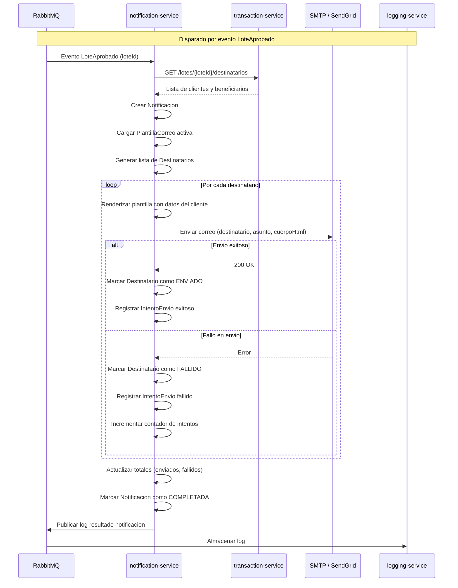

# Diagrama de Secuencia - Notificacion a Clientes

```mermaid
sequenceDiagram
    participant RMQ as RabbitMQ
    participant NS as notification-service
    participant TS as transaction-service
    participant SMTP as SMTP / SendGrid
    participant LS as logging-service

    Note over RMQ,LS: Disparado por evento LoteAprobado

    RMQ->>NS: Evento LoteAprobado (loteId)
    NS->>TS: GET /lotes/{loteId}/destinatarios
    TS-->>NS: Lista de clientes y beneficiarios

    NS->>NS: Crear Notificacion
    NS->>NS: Cargar PlantillaCorreo activa
    NS->>NS: Generar lista de Destinatarios

    loop Por cada destinatario
        NS->>NS: Renderizar plantilla con datos del cliente
        NS->>SMTP: Enviar correo (destinatario, asunto, cuerpoHtml)
        alt Envio exitoso
            SMTP-->>NS: 200 OK
            NS->>NS: Marcar Destinatario como ENVIADO
            NS->>NS: Registrar IntentoEnvio exitoso
        else Fallo en envio
            SMTP-->>NS: Error
            NS->>NS: Marcar Destinatario como FALLIDO
            NS->>NS: Registrar IntentoEnvio fallido
            NS->>NS: Incrementar contador de intentos
        end
    end

    NS->>NS: Actualizar totales (enviados, fallidos)
    NS->>NS: Marcar Notificacion como COMPLETADA

    NS->>RMQ: Publicar log resultado notificacion
    RMQ->>LS: Almacenar log
```
