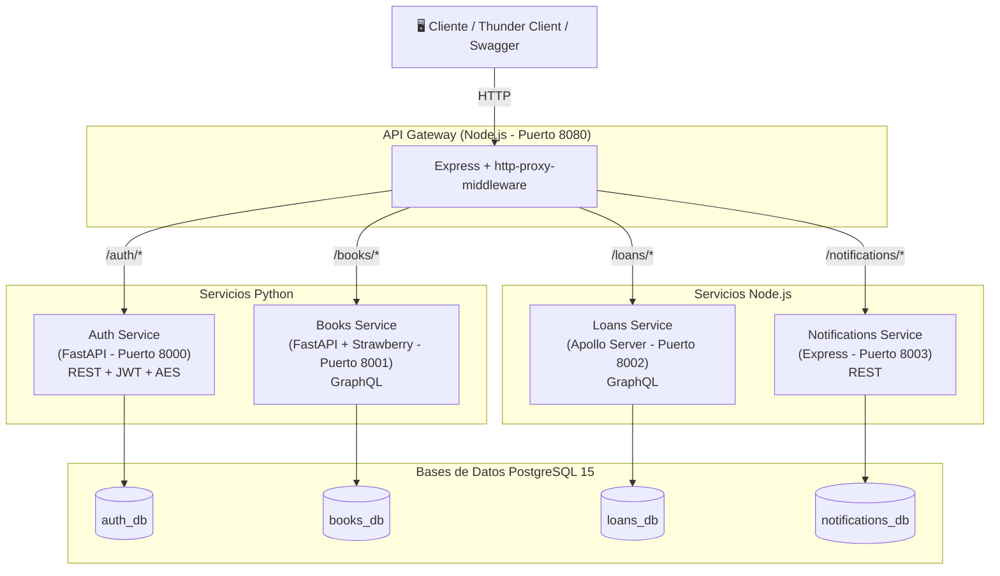

# Diagrama de Arquitectura - Sistema de Biblioteca

## Arquitectura General

El sistema sigue una arquitectura de microservicios donde todas las peticiones externas pasan a través del API Gateway, que enruta hacia el microservicio correspondiente. Cada microservicio tiene su propia base de datos PostgreSQL (database-per-service pattern).

### Lenguajes utilizados

- **Python (FastAPI):** auth-service, books-service
- **Node.js (Express/Apollo):** loans-service, notifications-service, api-gateway

### Diagrama

### Flujo de comunicación

1. El cliente envía una petición HTTP al API Gateway (puerto 8080)
2. El Gateway identifica la ruta y redirige al microservicio correspondiente
3. El microservicio procesa la petición y consulta su base de datos propia
4. La respuesta regresa al cliente a través del Gateway

### Puertos

| Servicio | Puerto | Protocolo |
|---|---|---|
| API Gateway | 8080 | HTTP/REST (proxy) |
| Auth Service | 8000 | HTTP/REST |
| Books Service | 8001 | HTTP/GraphQL |
| Loans Service | 8002 | HTTP/GraphQL |
| Notifications Service | 8003 | HTTP/REST |
