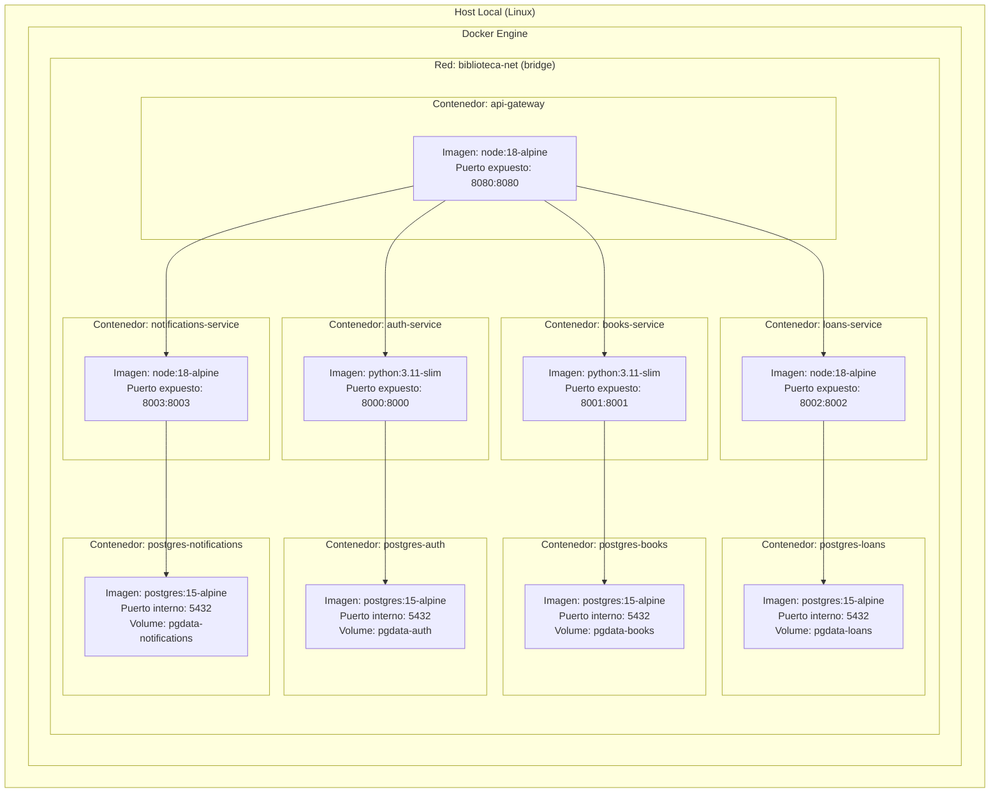

# Diagrama de Despliegue - Sistema de Biblioteca

## Infraestructura Docker

Todos los servicios corren como contenedores Docker orquestados por Docker Compose en una red bridge compartida llamada `biblioteca-net`.

### Diagrama

### Contenedores del sistema

| Contenedor | Imagen Base | Puerto Expuesto | Depende de |
|---|---|---|---|
| api-gateway | node:18-alpine | 8080 | auth, books, loans, notifications |
| auth-service | python:3.11-slim | 8000 | postgres-auth |
| books-service | python:3.11-slim | 8001 | postgres-books |
| loans-service | node:18-alpine | 8002 | postgres-loans |
| notifications-service | node:18-alpine | 8003 | postgres-notifications |
| postgres-auth | postgres:15-alpine | interno | - |
| postgres-books | postgres:15-alpine | interno | - |
| postgres-loans | postgres:15-alpine | interno | - |
| postgres-notifications | postgres:15-alpine | interno | - |

### Volúmenes persistentes

| Volumen | Contenedor | Ruta interna |
|---|---|---|
| pgdata-auth | postgres-auth | /var/lib/postgresql/data |
| pgdata-books | postgres-books | /var/lib/postgresql/data |
| pgdata-loans | postgres-loans | /var/lib/postgresql/data |
| pgdata-notifications | postgres-notifications | /var/lib/postgresql/data |

### Comando de despliegue

    docker compose up --build

### Comando para detener

    docker compose down

### Comando para limpiar todo (incluyendo volúmenes)

    docker compose down -v
