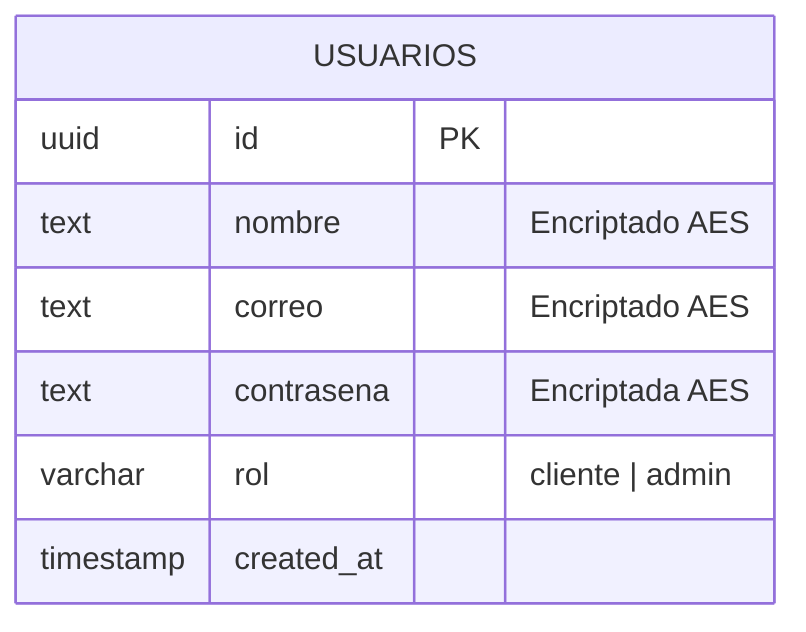
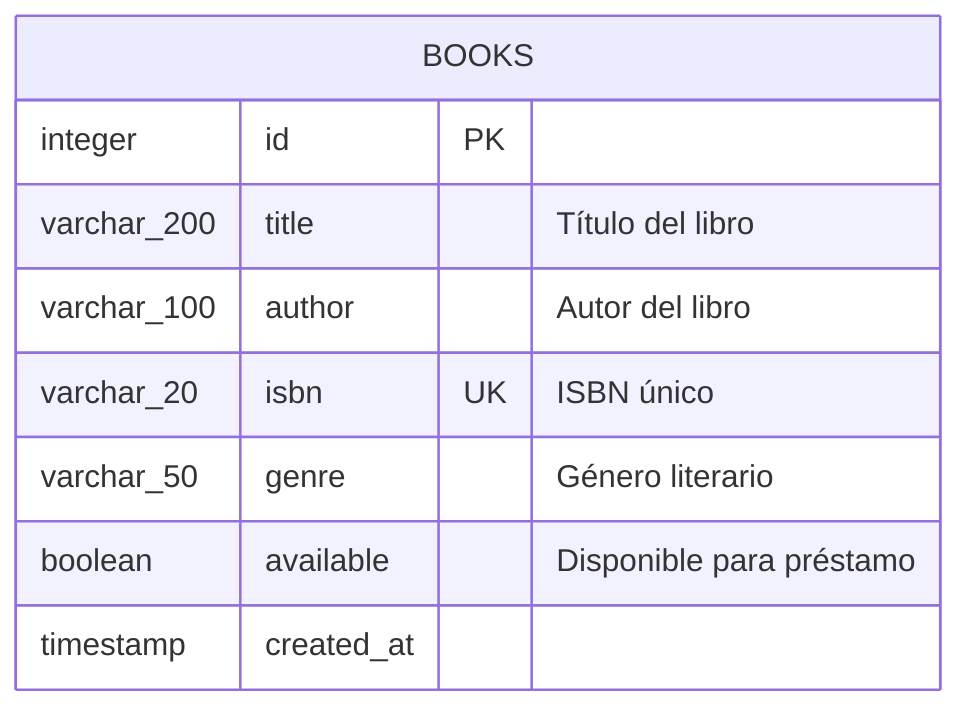
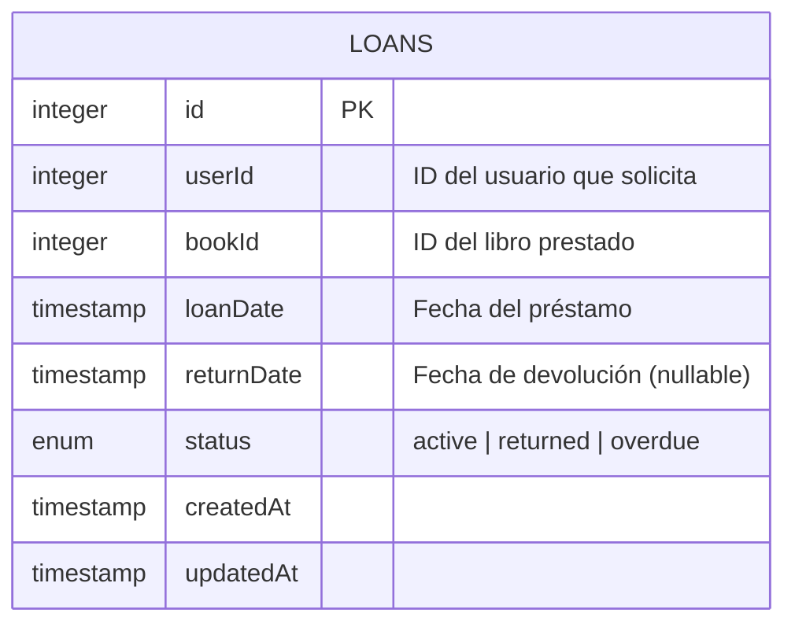
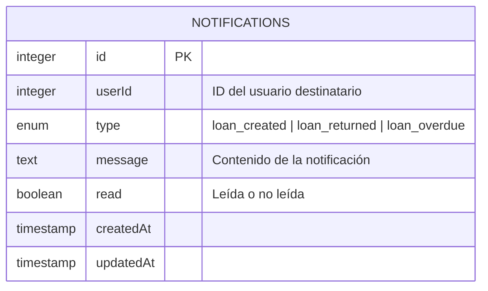
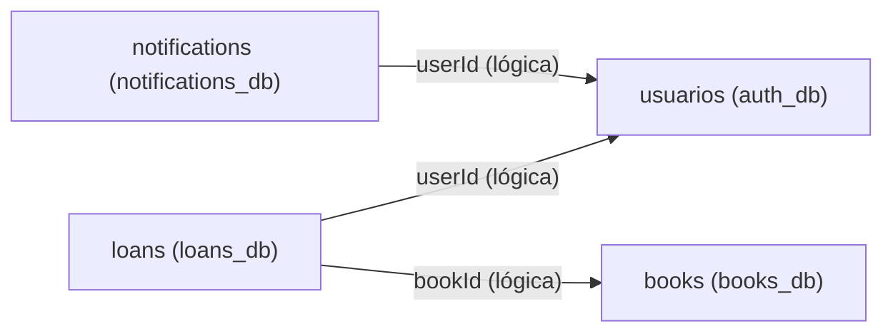

# Diagramas Entidad-Relación - Sistema de Biblioteca

Cada microservicio tiene su propia base de datos PostgreSQL independiente, siguiendo el patrón database-per-service.

---

## 1. Auth Service — auth_db

**Descripción:** Almacena los usuarios del sistema. Los campos nombre, correo y contraseña están encriptados con AES para proteger datos sensibles. El campo rol determina los permisos del usuario.

---

## 2. Books Service — books_db

**Descripción:** Catálogo de libros de la biblioteca. El campo isbn es único para evitar duplicados. El campo available indica si el libro está disponible para préstamo.

---

## 3. Loans Service — loans_db

**Descripción:** Registra los préstamos de libros. El campo status controla el ciclo de vida del préstamo: inicia como active, cambia a returned cuando se devuelve, o a overdue si se pasa la fecha límite. El userId y bookId son referencias lógicas a los otros microservicios.

---

## 4. Notifications Service — notifications_db

**Descripción:** Almacena las notificaciones del sistema. Cada notificación está asociada a un usuario y tiene un tipo que indica el evento que la generó. El campo read permite al usuario marcarla como leída.

---

## Relaciones lógicas entre servicios

Las relaciones entre microservicios son lógicas (no foreign keys directas), respetando el desacoplamiento:

> **Nota:** No existen foreign keys entre bases de datos distintas. Las referencias son lógicas y la consistencia se maneja a nivel de aplicación, siguiendo el principio de desacoplamiento de microservicios.
