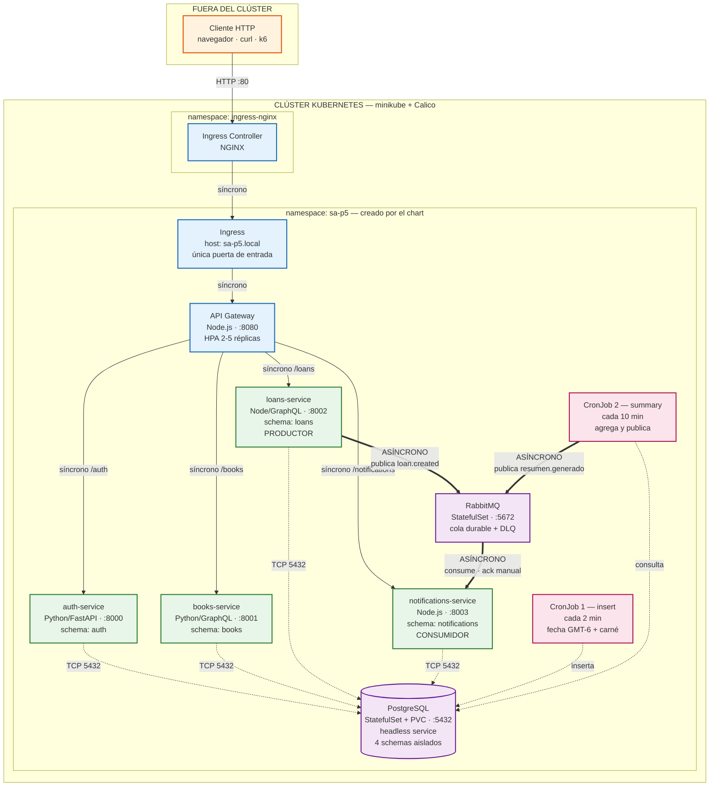
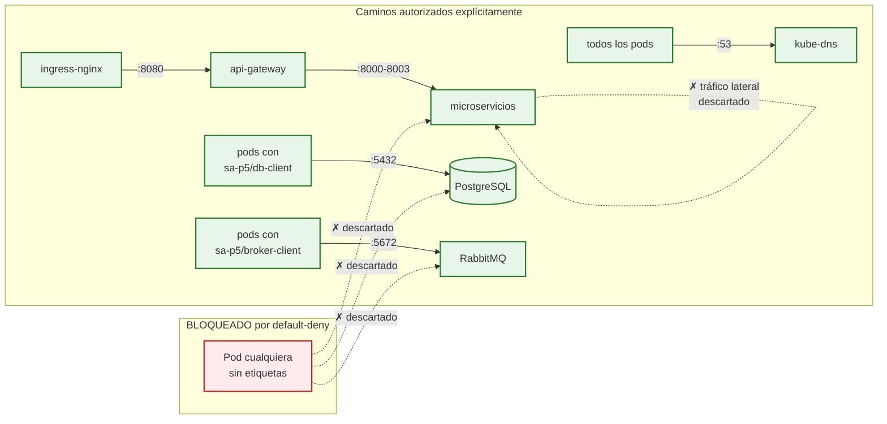
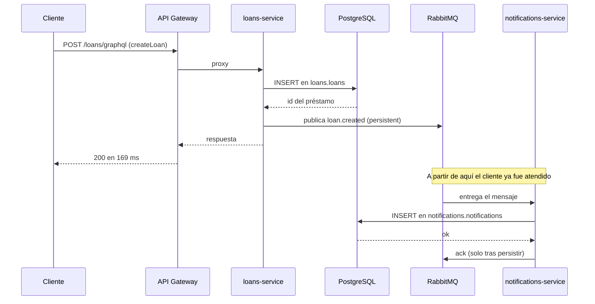
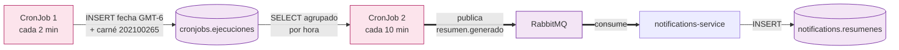

# Arquitectura de la plataforma

**Práctica 5 — Software Avanzado, Sección B**
**Maria Jose Tebalan Sanchez — Carné 202100265**

---

## 1. Diagrama general

Distingue los elementos externos al clúster de los internos, los flujos
síncronos de los asíncronos, y los límites que imponen las NetworkPolicies.



**Leyenda de los flujos**

| Trazo | Significado |
|---|---|
| `──▶` línea continua | Flujo **síncrono**: el llamador espera la respuesta |
| `- - ▶` línea punteada | Acceso a la base de datos (síncrono, sobre TCP 5432) |
| `══▶` línea gruesa | Flujo **asíncrono** a través del broker: el productor publica y retorna de inmediato |

---

## 2. Elementos internos y externos

| Elemento | Ubicación | Expuesto |
|---|---|---|
| Cliente HTTP | **Externo** al clúster | — |
| Ingress Controller NGINX | Interno, namespace `ingress-nginx` | Recibe el tráfico externo |
| Ingress `sa-platform` | Interno, namespace `sa-p5` | **Única puerta de entrada** |
| API Gateway | Interno, `sa-p5` | Solo vía Ingress (Service ClusterIP) |
| auth / books / loans / notifications | Interno, `sa-p5` | **No expuestos** — ClusterIP, solo alcanzables desde el gateway |
| PostgreSQL | Interno, `sa-p5` | **No expuesto** — ClusterIP + headless service |
| RabbitMQ | Interno, `sa-p5` | **No expuesto** — ClusterIP + headless service |
| CronJobs | Interno, `sa-p5` | Sin puertos; solo salida hacia BD y broker |

Ningún componente usa `NodePort` ni `LoadBalancer`:

```
$ kubectl get svc -n sa-p5
sa-platform-api-gateway             ClusterIP   8080/TCP
sa-platform-auth-service            ClusterIP   8000/TCP
sa-platform-books-service           ClusterIP   8001/TCP
sa-platform-loans-service           ClusterIP   8002/TCP
sa-platform-notifications-service   ClusterIP   8003/TCP
sa-platform-postgresql              ClusterIP   5432/TCP
sa-platform-postgresql-hl           ClusterIP   5432/TCP     <- headless
sa-platform-rabbitmq                ClusterIP   5672/TCP ...
sa-platform-rabbitmq-headless       ClusterIP   5672/TCP ...  <- headless
```

---

## 3. Límites impuestos por las NetworkPolicies

El namespace parte de una política **default-deny** que selecciona a todos los
pods y no autoriza nada. A partir de ahí solo se abren los caminos necesarios.



### Las 13 políticas desplegadas

| Política | Selecciona | Autoriza |
|---|---|---|
| `default-deny` | Todos los pods | **Nada** — cierra el namespace |
| `allow-dns` | Todos los pods | Salida a kube-dns (UDP/TCP 53) |
| `api-gateway-allow-ingress` | api-gateway | Entrada solo desde `ingress-nginx` |
| `api-gateway-allow-egress` | api-gateway | Salida hacia los 4 microservicios |
| `auth-service-allow-from-gateway` | auth-service | Entrada **solo** desde el gateway |
| `books-service-allow-from-gateway` | books-service | Entrada **solo** desde el gateway |
| `loans-service-allow-from-gateway` | loans-service | Entrada **solo** desde el gateway |
| `notifications-service-allow-from-gateway` | notifications-service | Entrada **solo** desde el gateway |
| `allow-db-clients-egress` | Pods con `sa-p5/db-client` | Salida hacia PostgreSQL :5432 |
| `postgresql-allow-clients` | PostgreSQL | Entrada solo de pods con `sa-p5/db-client` |
| `allow-broker-clients-egress` | Pods con `sa-p5/broker-client` | Salida hacia RabbitMQ :5672 |
| `rabbitmq-allow-clients` | RabbitMQ | Entrada solo de pods con `sa-p5/broker-client` |
| `dependencies-internal` | PostgreSQL y RabbitMQ | Tráfico interno y probes del kubelet |

### Qué queda bloqueado

- Un microservicio **no puede** alcanzar a otro microservicio directamente
  (todo pasa por el gateway).
- Un pod sin las etiquetas correspondientes **no puede** alcanzar la base de
  datos ni el broker.
- Nada externo entra al namespace salvo por el Ingress Controller.

Comprobado con evidencia en `evidencias/04-networkpolicies-bloqueo.md`.

### Nota sobre el CNI

Las NetworkPolicies **requieren un CNI que las implemente**. El CNI por defecto
de minikube (bridge) las acepta y las ignora en silencio: los objetos aparecen
en `kubectl get networkpolicy` y el tráfico sigue pasando. El clúster se levanta
con **Calico** por ese motivo:

```bash
minikube start --cni=calico ...
```

---

## 4. Asignación de las etiquetas de autorización

Las etiquetas que gobiernan el acceso a la base de datos y al broker **se
derivan de la configuración**, no de una lista escrita a mano:

```yaml
# values.yaml
services:
  loans-service:
    dbSchema: loans        # -> el Deployment añade sa-p5/db-client: "true"
    usesBroker: true       # -> el Deployment añade sa-p5/broker-client: "true"
```

```gotemplate
{{- if $cfg.usesBroker }}
sa-p5/broker-client: "true"
{{- end }}
{{- if $cfg.dbSchema }}
sa-p5/db-client: "true"
{{- end }}
```

Agregar un microservicio al mapa de `values.yaml` genera su Deployment, su
Service, su HPA, su PDB, su ServiceAccount con RBAC y sus autorizaciones de red,
sin escribir una sola plantilla nueva.

---

## 5. Persistencia y aislamiento de datos

En la Práctica 4 cada microservicio tenía su propia instancia de PostgreSQL. En
la Práctica 5 hay **una sola instancia desplegada como StatefulSet**, y cada
servicio queda aislado en su propio schema:

| Servicio | Schema | Tablas |
|---|---|---|
| auth-service | `auth` | usuarios |
| books-service | `books` | books |
| loans-service | `loans` | loans |
| notifications-service | `notifications` | notifications, resumenes |
| CronJobs | `cronjobs` | ejecuciones |

El aislamiento se logra fijando el `search_path` de cada conexión al schema del
servicio. Se conserva la separación lógica entre microservicios con un único PVC
y un único headless service, que es lo que el enunciado pide para la
persistencia.

```
StatefulSet: sa-platform-postgresql
PVC:         data-sa-platform-postgresql-0  (Bound, 1Gi)
Headless:    sa-platform-postgresql-hl      (ClusterIP: None)
```

---

## 6. Flujo asíncrono en detalle

### Flujo de negocio desacoplado: creación de un préstamo



El cliente recibe su respuesta en **169 ms** sin esperar a que la notificación
se genere. Si `notifications-service` estuviera caído, el préstamo se crearía
igual y el mensaje quedaría en la cola durable hasta que el consumidor volviera.

### Cadena de los CronJobs



---

## 7. Salud, escalado y resiliencia

### Probes diferenciadas

Cada Deployment define las tres probes apuntando a endpoints **distintos**,
porque cumplen funciones distintas:

| Probe | Endpoint | Consulta la BD | Qué responde |
|---|---|---|---|
| `startupProbe` | `/health/live` | No | ¿Terminó de arrancar? Mientras no tenga éxito, las otras dos quedan suspendidas |
| `livenessProbe` | `/health/live` | **No** | ¿Hay que reiniciar este pod? |
| `readinessProbe` | `/health/ready` | **Sí** | ¿Puede recibir tráfico? |

**Por qué liveness no consulta la base de datos.** Si lo hiciera, una caída
temporal de PostgreSQL reiniciaría todos los pods de todos los microservicios.
Reiniciar no arregla una base de datos caída: solo añade un CrashLoopBackOff al
incidente. La readiness sí la consulta, de modo que un pod que no puede atender
sale del balanceo pero sigue vivo y vuelve solo cuando la dependencia se
restablece.

**Por qué los servicios en Python tienen más margen en la startup probe**
(`failureThreshold: 24` frente a 18 de los Node): cargan más dependencias al
iniciar y además crean su schema en el arranque. Con un margen escaso, la
liveness empezaría a contar antes de tiempo y reiniciaría un pod que solo estaba
arrancando.

### Escalado y disponibilidad

| Mecanismo | Configuración | Propósito |
|---|---|---|
| HPA | min 2, max 5, 70 % CPU | Escalado automático bajo carga |
| PodDisruptionBudget | `minAvailable` acotado a réplicas−1 | Limita interrupciones voluntarias |
| RollingUpdate | `maxUnavailable: 0`, `maxSurge: 1` | Actualización sin caída de servicio |
| ResourceQuota | Dimensionada para el pico del HPA | Techo del namespace |
| LimitRange | Defaults y máximo por contenedor | Evita pods sin recursos declarados |

---

## 8. Seguridad

### RBAC de mínimo privilegio

Cada microservicio y cada cronjob tiene su **ServiceAccount dedicado**; el
ServiceAccount `default` no se usa en ninguna carga de trabajo.

Estas aplicaciones no consultan la API de Kubernetes: obtienen su configuración
por variables de entorno. Los Roles conceden únicamente lectura del ConfigMap y
del Secret que cada carga consume, **y solo de esos objetos por nombre**
mediante `resourceNames`, de modo que ni siquiera pueden enumerar los demás
secretos del namespace. Los tokens no se montan en los pods
(`automountServiceAccountToken: false`).

### securityContext restrictivo

```yaml
securityContext:
  runAsNonRoot: true
  runAsUser: 1000
  runAsGroup: 1000
  readOnlyRootFilesystem: true
  allowPrivilegeEscalation: false
  capabilities:
    drop: [ALL]
```

Las siete imágenes se construyen con multi-stage build y usuario sin
privilegios; se verificó que arrancan con `--read-only --user 1000:1000` contra
una base de datos real. Como el sistema de archivos es de solo lectura, se monta
un `emptyDir` en `/tmp` para los temporales que las librerías puedan necesitar.

### Gestión de credenciales

Ninguna credencial está versionada en el repositorio. Los campos sensibles
quedan vacíos en `values.yaml` y el chart los valida con `required`, de modo que
una instalación sin credenciales se detiene con un mensaje explícito en lugar de
desplegar pods que entrarían en CrashLoopBackOff:

```
Error: execution error at (sa-platform/templates/secret.yaml:20:5):
postgresql.auth.password es obligatorio (usar --set o un values propio, nunca versionarlo)
```

Se entrega `values.example.yaml` con valores ficticios; el archivo real
(`values.secret.yaml`) está excluido por `.gitignore`.
