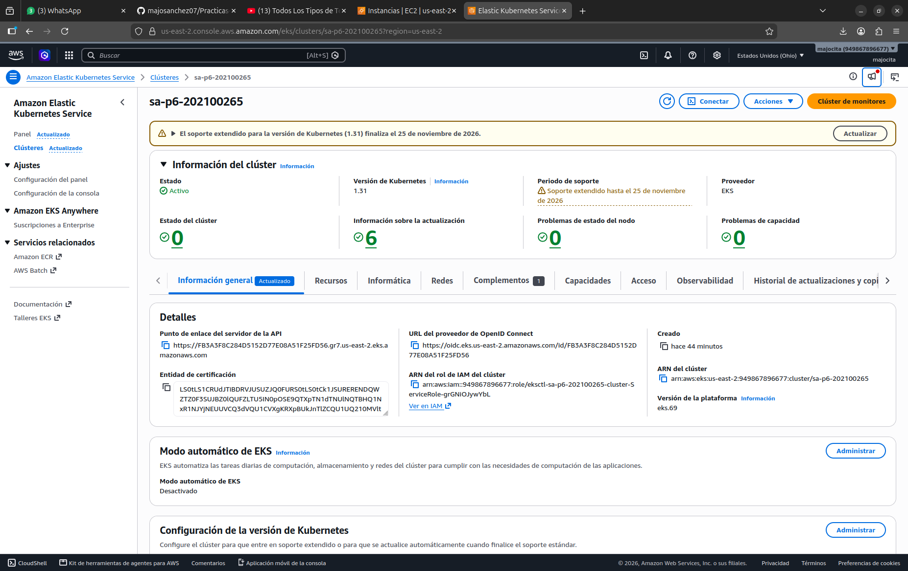
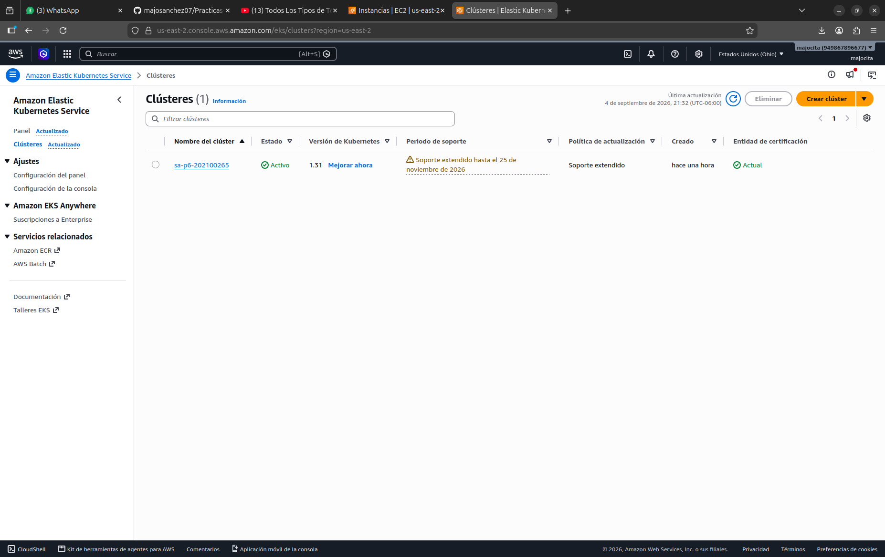
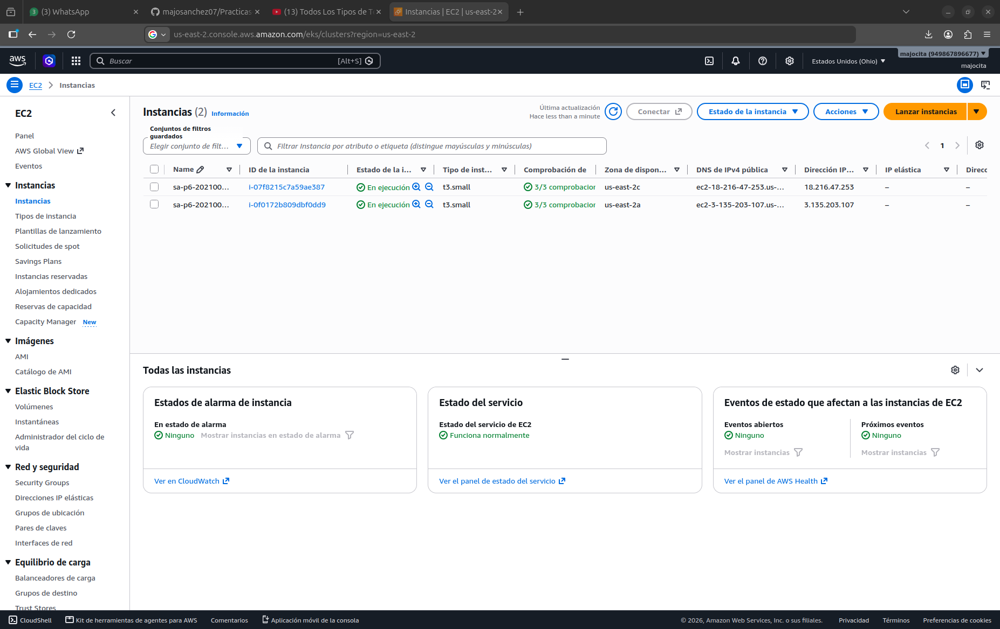
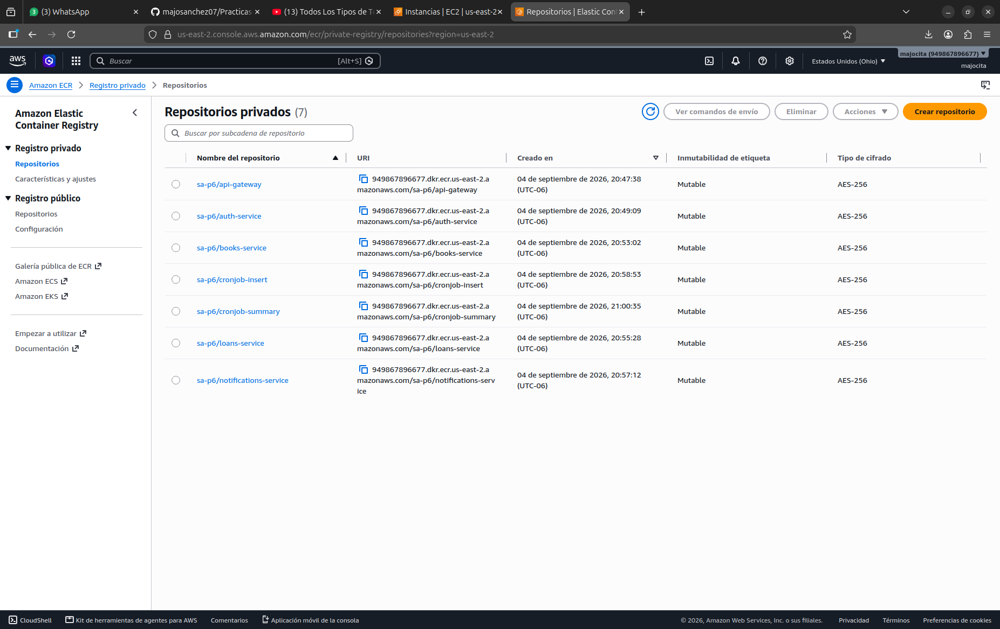
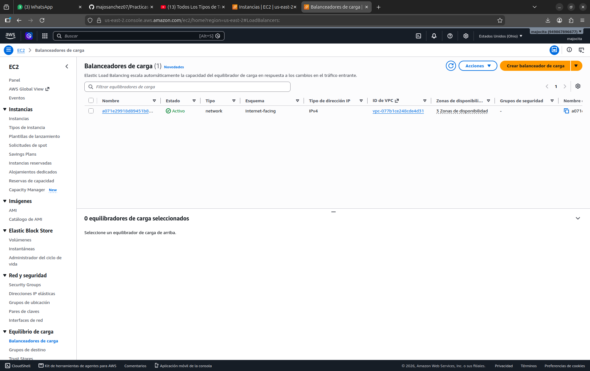
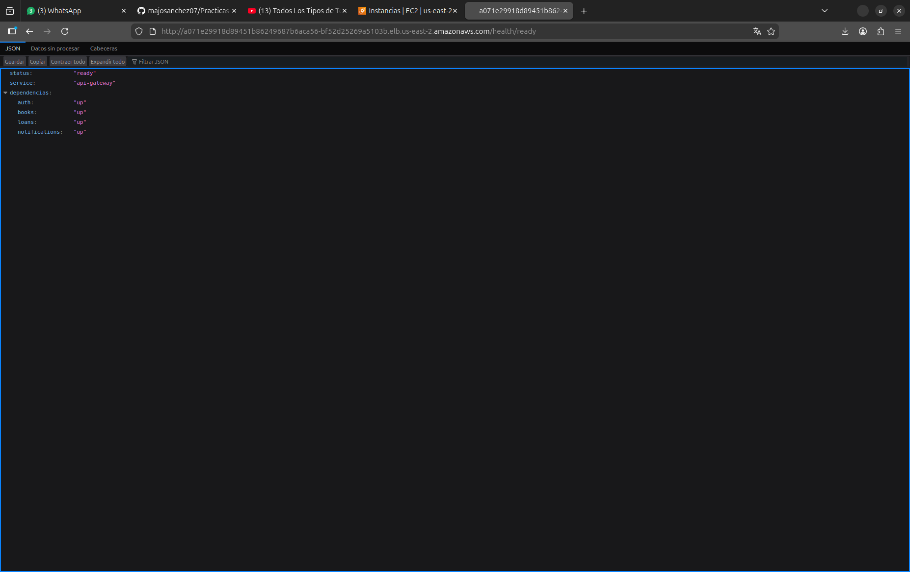
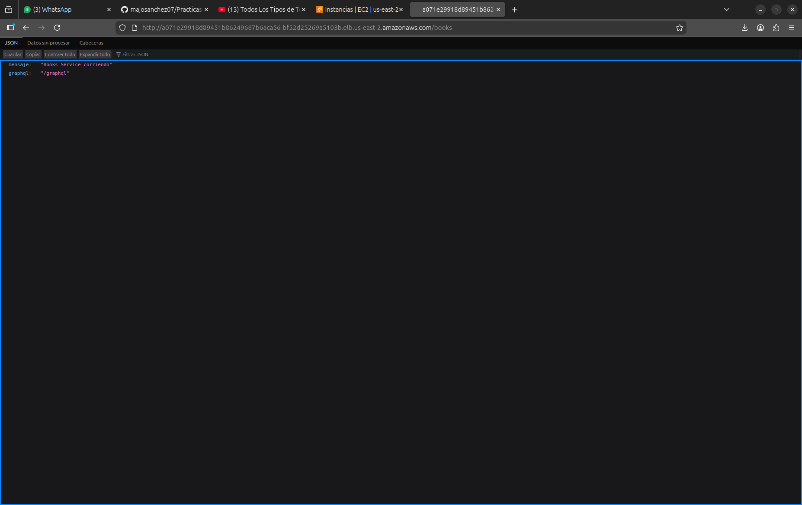
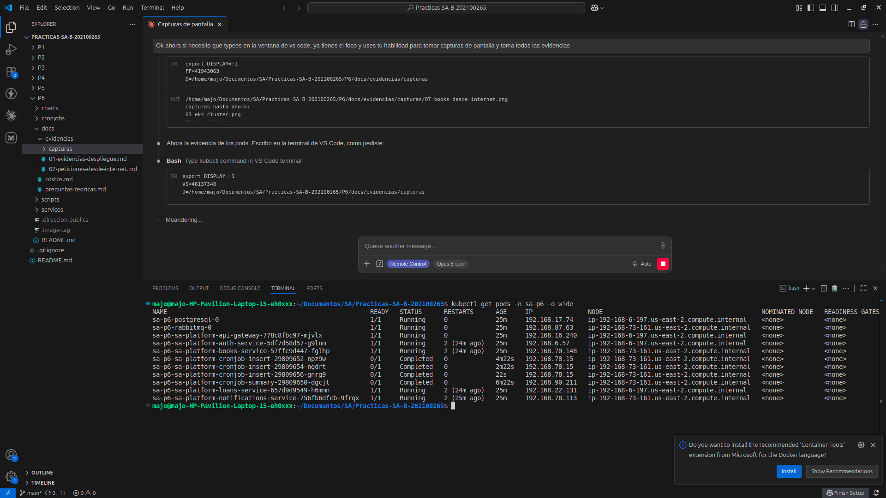
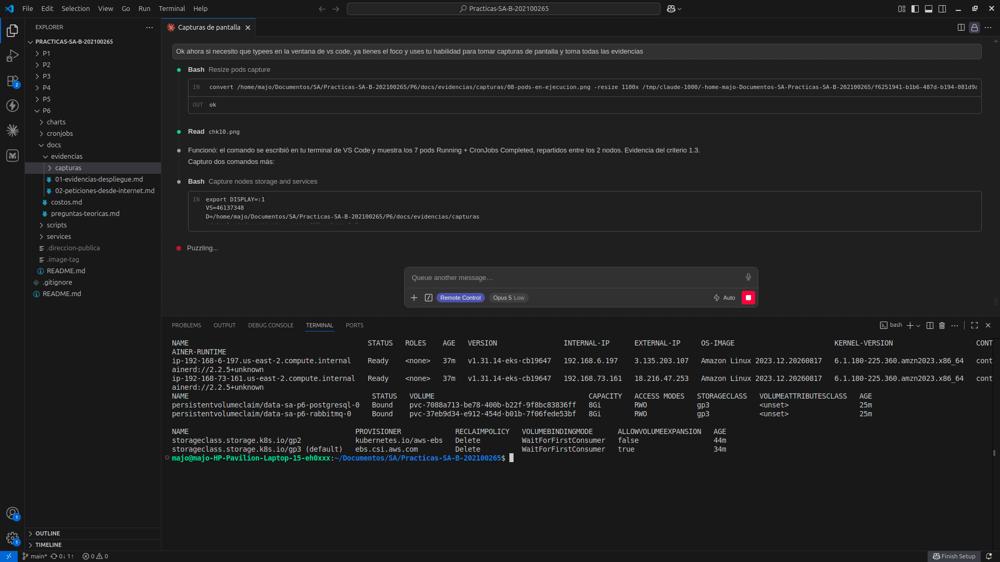
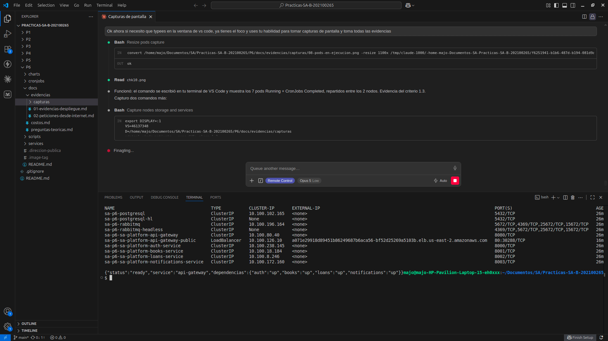

# Capturas de pantalla — Evidencias de la Práctica 6

Tomadas el 04 de septiembre de 2026 sobre el despliegue real en AWS,
cuenta `949867896677`, región `us-east-2` (Ohio).

## 1. El clúster administrado en la consola del proveedor

El clúster `sa-p6-202100265` en estado **Activo**, con Kubernetes **1.31** y el
proveedor **EKS**. Se aprecian el punto de enlace del servidor de la API, la URL
del proveedor OpenID Connect y el ARN del rol de IAM: elementos que sólo existen
en un clúster administrado y que no tienen equivalente en uno local.

## 2. Los nodos de trabajo

Las **dos instancias `t3.small`** del grupo de nodos, en ejecución y repartidas
entre las zonas de disponibilidad `us-east-2a` y `us-east-2c`, cada una con sus
3/3 comprobaciones de estado superadas.

## 3. El registro de contenedores

Los **siete repositorios privados** creados en Amazon ECR, uno por componente:
los cinco microservicios y los dos cronjobs. Se muestra la URI completa de cada
uno, que es la que aparece en el campo `image` de los Deployments.

## 4. El balanceador de carga

El **Network Load Balancer** creado automáticamente por el
cloud-controller-manager de EKS al aplicar el Service de tipo LoadBalancer:
estado **Activo**, tipo **network**, esquema **Internet-facing**, distribuido en
**3 zonas de disponibilidad**.

## 5. El sistema respondiendo desde internet

El navegador apuntando a la dirección pública del balanceador
(`http://a071e29918d89451b86249687b6aca56-bf52d25269a5103b.elb.us-east-2.amazonaws.com/health/ready`).
La respuesta JSON declara `status: "ready"` y las cuatro dependencias internas
(`auth`, `books`, `loans`, `notifications`) en `"up"`, lo que demuestra a la vez
el acceso público y el enrutamiento interno entre microservicios.

## 6. Los componentes en ejecución dentro del clúster

Los **siete pods en `Running`** —los cinco microservicios más PostgreSQL y
RabbitMQ— repartidos entre los dos nodos, junto con los CronJobs en
`Completed`. Ningún pod en error, ningún `ImagePullBackOff`.

## 7. Almacenamiento persistente del proveedor

Los PersistentVolumeClaim en estado `Bound` sobre la StorageClass **`gp3`**,
respaldada por el driver CSI de EBS (`ebs.csi.aws.com`).

## 8. Aislamiento de la red

Todos los Services son `ClusterIP` excepto el único `LoadBalancer`, que expone
el API Gateway. La base de datos, el broker y los microservicios internos no son
alcanzables desde internet. Abajo, la petición `curl` a la dirección pública
devolviendo la respuesta del health check.
