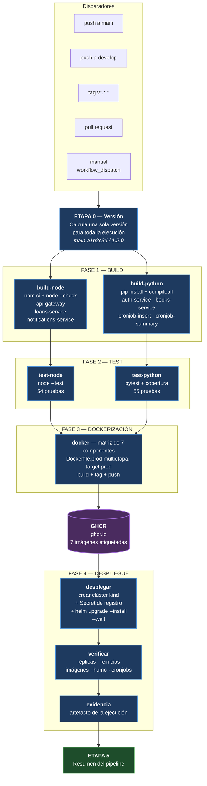
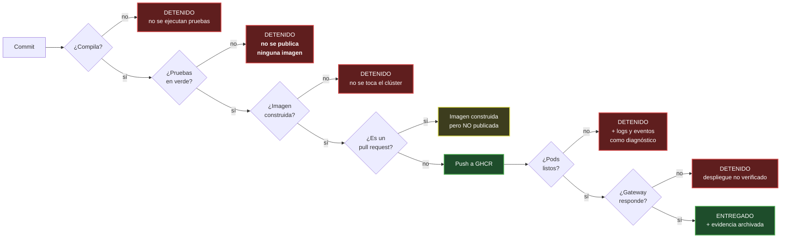
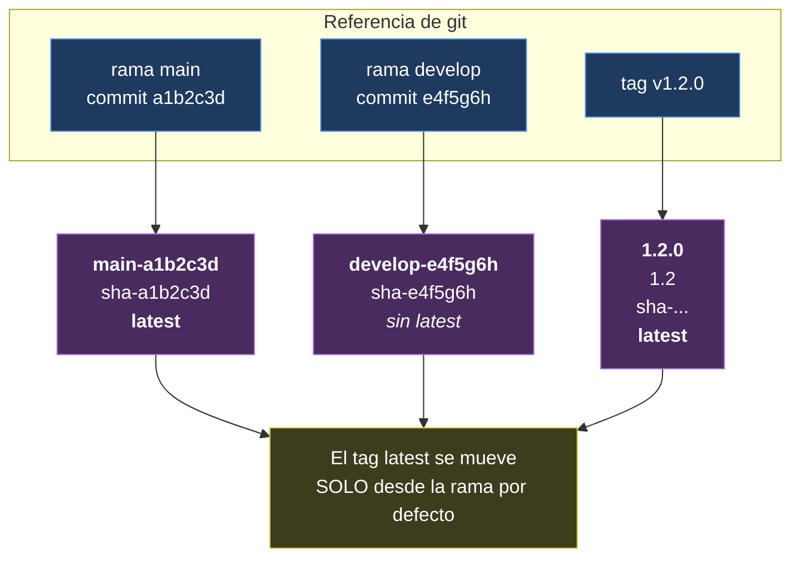

# Diagrama del pipeline CI/CD

**María José Tebalán Sánchez — 202100265**

## 1. Vista general del flujo

Las cuatro fases solicitadas por el enunciado —**build, test, dockerización y
despliegue**— más la etapa de versionado que las precede y la verificación que
las cierra.

## 2. Puertas de control: qué detiene el pipeline

Las dependencias `needs:` no son decorativas. Definen en qué punto se detiene
todo cuando algo sale mal, y ese es el valor real de la integración continua.

## 3. Qué se construye y dónde termina

Los siete componentes recorren el pipeline en paralelo mediante estrategias
matriciales, y terminan como pods en el clúster.

```mermaid
flowchart LR
    subgraph codigo["Código fuente — P7/"]
        direction TB
        S1["services/api-gateway<br/><i>Node</i>"]
        S2["services/auth-service<br/><i>Python</i>"]
        S3["services/books-service<br/><i>Python</i>"]
        S4["services/loans-service<br/><i>Node</i>"]
        S5["services/notifications-service<br/><i>Node</i>"]
        C1["cronjobs/cronjob-insert<br/><i>Python</i>"]
        C2["cronjobs/cronjob-summary<br/><i>Python</i>"]
    end

    codigo -->|"Dockerfile.prod<br/>multietapa"| IMG

    subgraph IMG["Imágenes en GHCR"]
        direction TB
        I1["p7-api-gateway"]
        I2["p7-auth-service"]
        I3["p7-books-service"]
        I4["p7-loans-service"]
        I5["p7-notifications-service"]
        I6["p7-cronjob-insert"]
        I7["p7-cronjob-summary"]
    end

    IMG -->|"helm upgrade --install<br/>values-ci.yaml"| K8S

    subgraph K8S["Clúster — namespace sa-p7"]
        direction TB
        D1["5 Deployments"]
        D2["2 CronJobs"]
        D3["PostgreSQL + RabbitMQ<br/><i>subcharts Bitnami<br/>desde Docker Hub</i>"]
    end

    classDef fuente fill:#1e3a5f,stroke:#4a90d9,color:#fff
    classDef imagen fill:#4a2b5f,stroke:#a06cd5,color:#fff
    classDef cluster fill:#1e4d2b,stroke:#4caf50,color:#fff
    class S1,S2,S3,S4,S5,C1,C2 fuente
    class I1,I2,I3,I4,I5,I6,I7 imagen
    class D1,D2,D3 cluster
```

## 4. Esquema de versionado

Una misma ejecución etiqueta cada imagen varias veces, según el disparador.

## 5. Tiempos aproximados

| Etapa | Duración típica | Paralelismo |
|---|---|---|
| 0 — Versión | ~10 s | 1 job |
| 1 — Build | ~1 min | 7 jobs en paralelo |
| 2 — Test | ~1 min | 5 jobs en paralelo |
| 3 — Docker | 2–6 min | 7 jobs en paralelo (con caché, ~2 min) |
| 4 — Despliegue | 6–10 min | 1 job |
| **Total** | **~10–18 min** | |

La etapa de despliegue domina el tiempo porque crea un clúster desde cero,
descarga PostgreSQL y RabbitMQ, y espera a que todos los pods pasen sus probes.
