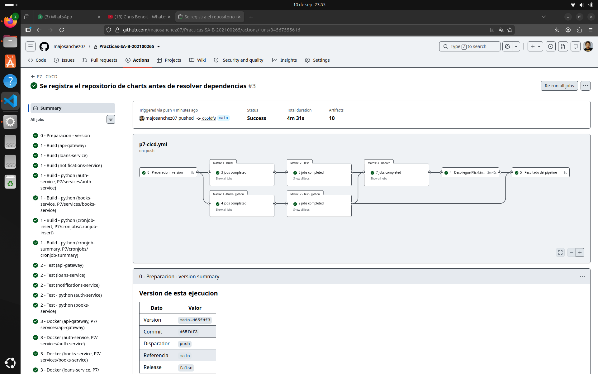
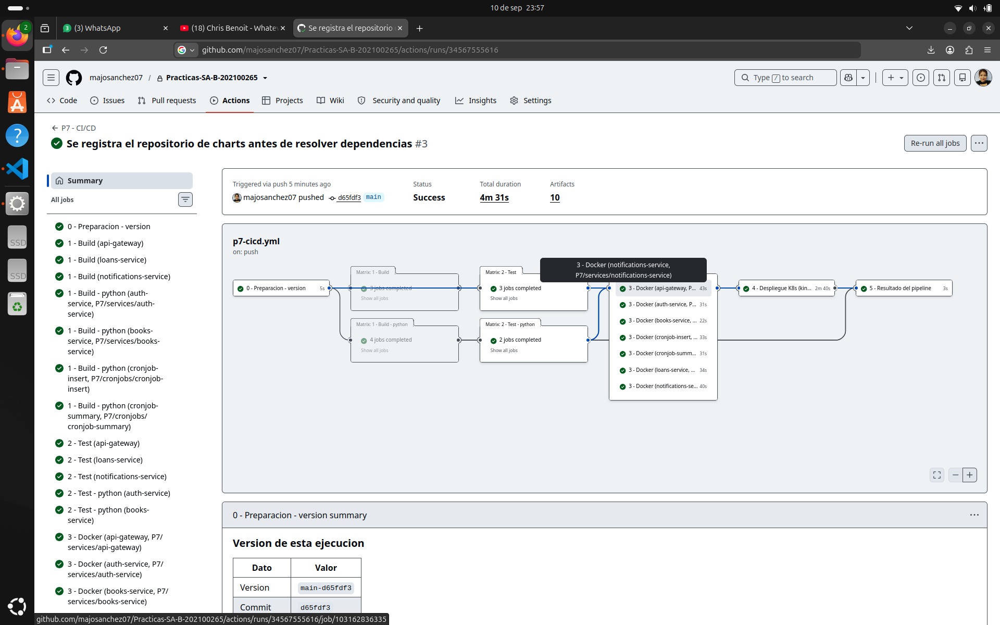
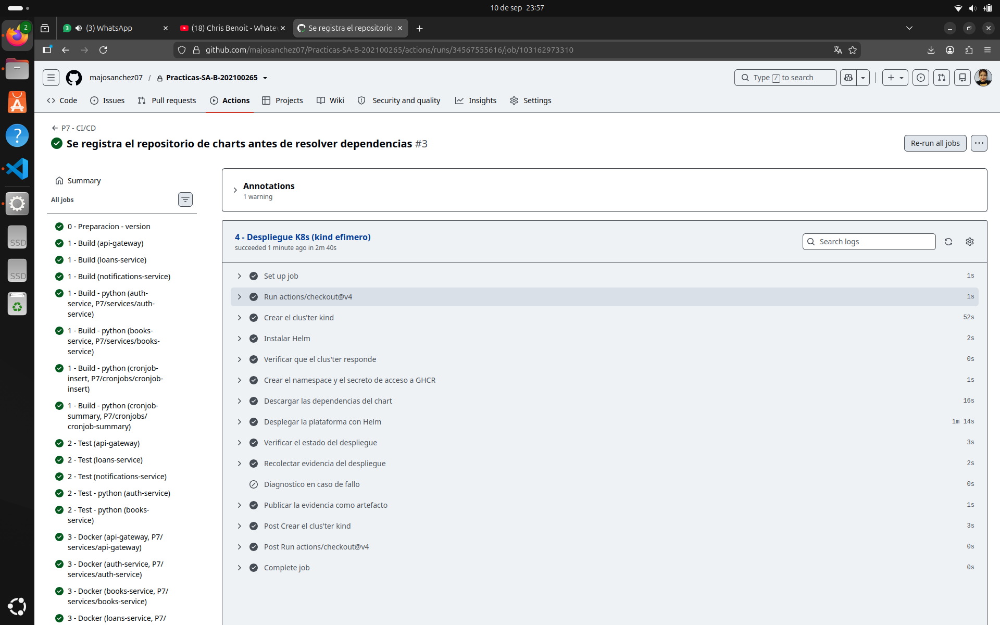

# Evidencias de ejecución — Práctica 7

**María José Tebalán Sánchez — 202100265**

Este documento reúne las evidencias de que el pipeline funciona. Se organizan en
dos bloques: la ejecución del pipeline en GitHub Actions y la verificación del
despliegue en Kubernetes.

---

## 1. Ejecución del pipeline en GitHub Actions

**Ejecución #3 — commit `d65fdf3` — estado: Success — duración total: 4m 31s.**

El pipeline se disparó solo al hacer `push` sobre `main`, recorrió sus seis
etapas y terminó en verde, publicando 10 artefactos.



| Etapa | Jobs | Resultado |
|---|---|---|
| 0 · Preparación - versión | 1 | Correcto (5s) |
| 1 · Build | 3 Node + 4 Python | 7/7 correctos |
| 2 · Test | 3 Node + 2 Python | 5/5 correctos |
| 3 · Docker | 7 componentes | 7/7 publicados |
| 4 · Despliegue K8s | 1 | Correcto (2m 40s) |
| 5 · Resultado | 1 | Correcto (3s) |

### Etapa 0 — la versión de la ejecución

La primera etapa calcula la versión que compartirán las siete imágenes y la
publica en el resumen del workflow:

| Dato | Valor |
|---|---|
| Version | `main-d65fdf3` |
| Commit | `d65fdf3` |
| Disparador | `push` |
| Referencia | `main` |
| Release | `false` |

Que el disparador sea `push` sobre `main` es justamente lo que el enunciado pide
demostrar: el pipeline arranca solo al integrar un cambio, sin lanzarlo a mano.

### Etapa 3 — las siete imágenes publicadas en GHCR

La matriz construye y publica los siete componentes en paralelo. Los siete
terminaron correctamente, entre 22 y 43 segundos cada uno:



```
3 - Docker (api-gateway)            43s
3 - Docker (auth-service)           31s
3 - Docker (books-service)          22s
3 - Docker (cronjob-insert)         33s
3 - Docker (cronjob-summary)        31s
3 - Docker (loans-service)          34s
3 - Docker (notifications-service)  40s
```

### Etapa 4 — el despliegue automático en Kubernetes

El job completo, paso a paso, en 2m 40s:



| Paso | Duración |
|---|---|
| Crear el clúster kind | 52s |
| Instalar Helm | 2s |
| Verificar que el clúster responde | 0s |
| Crear el namespace y el secreto de acceso a GHCR | 1s |
| Descargar las dependencias del chart | 16s |
| **Desplegar la plataforma con Helm** | **1m 14s** |
| **Verificar el estado del despliegue** | **3s** |
| Recolectar evidencia del despliegue | 2s |
| Publicar la evidencia como artefacto | 1s |

El paso «Diagnóstico en caso de fallo» aparece omitido porque está condicionado
con `if: failure()`: al no haber fallo, no se ejecutó. Que esté en gris es en sí
mismo evidencia de que el despliegue salió bien.

### Lo que costó dejar el pipeline en verde

Dos fallos, ambos por la misma causa de fondo: **el runner arranca limpio y una
máquina de trabajo no**.

1. `found in Chart.yaml, but missing in charts/ directory: postgresql, rabbitmq`
   — los `.tgz` de los subcharts no se versionan. En local ya estaban
   descargados; el runner clona el repositorio y no los tiene. Se resolvió
   agregando `helm dependency build`.

2. `no repository definition for https://charts.bitnami.com/bitnami` — resolver
   las dependencias exige además que el repositorio de charts esté registrado.
   En local lo estaba desde hacía tiempo; el runner no. Se resolvió agregando
   `helm repo add bitnami` y `helm repo update` antes del build.

Los dos casos son un buen ejemplo de por qué el pipeline aporta algo que una
prueba local no puede dar: obliga a que el proceso funcione desde cero, sin
apoyarse en nada que alguien haya dejado configurado a mano en su equipo.

### Artefactos generados

Cada ejecución publica 10 artefactos descargables desde la página de la corrida:
los reportes de cobertura de los servicios Python y el paquete
`evidencia-despliegue-<sha>` con el estado completo del clúster, recolectado por
[`recolectar-evidencia.sh`](../../scripts/recolectar-evidencia.sh).

---

## 2. Despliegue verificado en Kubernetes

La carpeta [`despliegue-local/`](despliegue-local/) contiene la evidencia de una
ejecución real del despliegue, capturada con el mismo script que corre el
pipeline.

### Estado de los pods

Los cinco microservicios, PostgreSQL y RabbitMQ, todos listos:

```
NAME                                                READY   STATUS    RESTARTS
sa-platform-api-gateway-5dfdd8fb9-wvsx5             1/1     Running   0
sa-platform-auth-service-5cf475865b-nktr5           1/1     Running   2
sa-platform-books-service-74cb6f59d4-jbfg8          1/1     Running   2
sa-platform-loans-service-67d5d9c8f5-n7wcj          1/1     Running   2
sa-platform-notifications-service-76466f6f6b-ld7wz  1/1     Running   2
sa-platform-postgresql-0                            1/1     Running   0
sa-platform-rabbitmq-0                              1/1     Running   0
```

Los dos reinicios de los microservicios son esperados y no indican un problema:
la `startupProbe` de cada servicio falla mientras PostgreSQL termina de
inicializarse, y Kubernetes reinicia el contenedor hasta que la dependencia está
lista. Es el comportamiento correcto —el orden de arranque no se coordina a mano,
sino que cada servicio reintenta— y por eso el script de verificación tolera
hasta dos reinicios antes de considerarlo un fallo.

### Imágenes efectivamente desplegadas

```
TIPO         NOMBRE                              IMAGEN
Deployment   sa-platform-api-gateway             p7-api-gateway:local
Deployment   sa-platform-auth-service            p7-auth-service:local
Deployment   sa-platform-books-service           p7-books-service:local
Deployment   sa-platform-loans-service           p7-loans-service:local
Deployment   sa-platform-notifications-service   p7-notifications-service:local
CronJob      sa-platform-cronjob-insert          p7-cronjob-insert:local
CronJob      sa-platform-cronjob-summary         p7-cronjob-summary:local
```

En el pipeline, esta misma salida muestra las imágenes de GHCR con el tag de la
ejecución (`ghcr.io/<usuario>/<repo>/p7-auth-service:main-<sha>`), que es lo que
demuestra que el clúster está corriendo exactamente lo que se acaba de construir.

### Prueba de humo contra el API Gateway

```
OK   GET /            -> 200
{"mensaje":"API Gateway - Biblioteca","version":"1.1.0",
 "servicios":{"auth":"/auth","books":"/books","loans":"/loans","notifications":"/notifications"}}

OK   GET /health/live -> 200
{"status":"alive","service":"api-gateway"}

OK   GET /health/ready -> 200
{"status":"ready","service":"api-gateway",
 "dependencias":{"auth":"up","books":"up","loans":"up","notifications":"up"}}
```

La tercera respuesta es la más significativa: `/health/ready` del gateway
consulta a los cuatro microservicios aguas abajo, así que los cuatro `up`
confirman que la cadena completa quedó operativa, no solo que el gateway arrancó.

### CronJobs programados

```
NAME                          SCHEDULE       TIMEZONE            SUSPEND   ACTIVE
sa-platform-cronjob-insert    */2 * * * *    America/Guatemala   False     0
sa-platform-cronjob-summary   */10 * * * *   America/Guatemala   False     0
```

### Resultado

```
RESULTADO: despliegue verificado correctamente.
```

---

## 3. Archivos de evidencia

| Archivo | Contenido |
|---|---|
| [`00-resumen.md`](despliegue-local/00-resumen.md) | Resumen con pods e imágenes |
| [`01-objetos.txt`](despliegue-local/01-objetos.txt) | Todos los objetos del namespace |
| [`02-imagenes-desplegadas.txt`](despliegue-local/02-imagenes-desplegadas.txt) | Imagen de cada carga de trabajo |
| [`03-pods.txt`](despliegue-local/03-pods.txt) | Estado de los pods |
| [`04-pods-detalle.txt`](despliegue-local/04-pods-detalle.txt) | `describe` completo, con probes y eventos |
| [`05-eventos.txt`](despliegue-local/05-eventos.txt) | Eventos del namespace en orden cronológico |
| [`06-objetos-kubernetes.txt`](despliegue-local/06-objetos-kubernetes.txt) | ConfigMap, Secrets, HPA, NetworkPolicies, cuotas, PVC |
| [`07-release-helm.txt`](despliegue-local/07-release-helm.txt) | Release de Helm instalado |
| [`logs/`](despliegue-local/logs/) | Logs de arranque de cada pod |

El archivo de objetos de Kubernetes registra **solo los nombres** de los
`Secret`, nunca su contenido: la evidencia no debe filtrar credenciales.

---

## 4. Pruebas unitarias

Las 105 pruebas ejecutándose localmente, que es exactamente lo que corre la
etapa 2 del pipeline:

```
$ ./P7/scripts/pruebas-locales.sh

>> api-gateway (Node)            # tests 19  # pass 19  # fail 0
>> loans-service (Node)          # tests 20  # pass 20  # fail 0
>> notifications-service (Node)  # tests 15  # pass 15  # fail 0
>> auth-service (Python)         38 passed
>> books-service (Python)        17 passed

Todas las pruebas pasan. El pipeline deberia quedar en verde.
```
