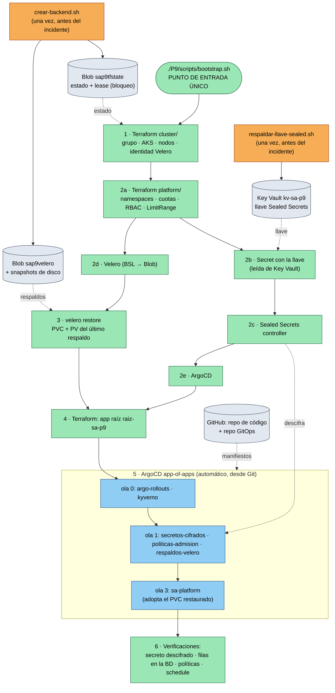

# Diagrama del bootstrap: orden de reconstrucción

Práctica 9 · María José Tebalán Sánchez · 202100265

El diagrama muestra el **orden** en que se reconstruye el sistema y de qué
depende cada paso. No es un diagrama de arquitectura. Las cajas **grises** viven
fuera del clúster, en `rg-sa-p9-base-202100265`, y sobreviven al desastre. Las **naranjas** son el único paso
manual, que se hace una sola vez y antes de cualquier incidente. Las **verdes**
son automáticas y las lanza `P9/scripts/bootstrap.sh`.

## Dependencias críticas

| Paso | Depende de | Por qué ese orden |
|---|---|---|
| 2b llave antes de 2c controlador | Key Vault | Si el controlador arranca sin la llave, genera una nueva y los SealedSecret del repositorio quedan ilegibles. |
| 3 restauración antes de 4 app raíz | Velero listo y respaldos en Blob | Si ArgoCD crea PostgreSQL antes, nace un PVC vacío con el mismo nombre y Velero no lo sobrescribe. |
| Ola 0 antes de la ola 1 | CRDs de Kyverno y Rollouts | Las políticas (`ClusterPolicy`) y el `Rollout` necesitan sus CRD. |
| Ola 1 antes de la ola 3 | `sa-platform-secret` descifrado | PostgreSQL y los servicios leen sus credenciales de ese Secret. |
| Todo | Sesión `az login` del operador | Es la única credencial que se necesita. Las demás se derivan de ella (workload identity, credenciales de AKS). |
